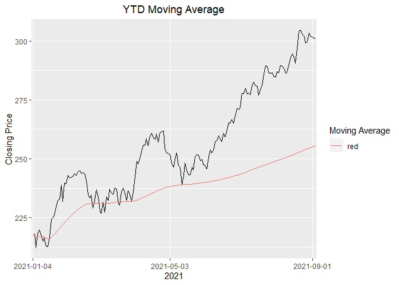
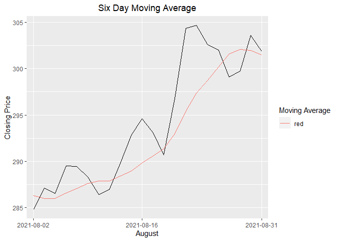

## Pull MSFT Stock Data

_tseries_ library has a straightforward way to pull stock data using ```  get.hist.quote ```


```r
msft_daily <- suppressMessages(get.hist.quote("MSFT"))
```

```
## time series ends   2021-09-03
```

```r
msft_daily <- data.frame(msft_daily, Date = time(msft_daily))
msft_daily$Year <- year(msft_daily$Date)
msft_daily$Month <- month(msft_daily$Date)
msft_daily$Date <- as.character(msft_daily$Date) #sqllite has no date format so store as text
```


## SQLlite Setup


```r
mydb <- dbConnect(RSQLite::SQLite(), "msft.sqlite")
```


```r
# Overwriting is simplier while testing - could set it up to only append new data
dbWriteTable(mydb, "msft_daily", msft_daily, overwrite=TRUE)
```

## Window Functions


### Six Day Moving Average


```r
six_day_ma <- dbGetQuery(mydb, 
           'SELECT date(Date) as Date, Month, 
           Close, 
           avg(Close) 
           OVER (
            ORDER BY Date
            ROWS BETWEEN 5 PRECEDING AND CURRENT ROW) AS running_avg 
            FROM msft_daily WHERE Date > "2021-01-01" ORDER BY Date DESC')
head(six_day_ma)
```

```
##         Date Month  Close running_avg
## 1 2021-09-03     9 301.14    301.5517
## 2 2021-09-02     9 301.15    301.2100
## 3 2021-09-01     9 301.83    301.3533
## 4 2021-08-31     8 301.88    301.4850
## 5 2021-08-30     8 303.59    301.9467
## 6 2021-08-27     8 299.72    302.0750
```

### Year-to-Date Moving Average


```r
ytd_avg <- dbGetQuery(mydb, 
           'SELECT date(Date) as Date, Month,
           Close, 
           avg(Close) 
           OVER (
            PARTITION BY Year
            ORDER BY Date
            ) AS YTD_running_avg
            FROM msft_daily WHERE Date > "2021-01-01" ORDER BY Date DESC')
head(ytd_avg)
```

```
##         Date Month  Close YTD_running_avg
## 1 2021-09-03     9 301.14        255.6316
## 2 2021-09-02     9 301.15        255.3624
## 3 2021-09-01     9 301.83        255.0898
## 4 2021-08-31     8 301.88        254.8099
## 5 2021-08-30     8 303.59        254.5264
## 6 2021-08-27     8 299.72        254.2290
```

## Plotting MSFT Stock Prices


```r
ytd_avg %>% ggplot(., aes(x=Date)) + geom_line(aes(y=Close, group=1)) + geom_line(aes(y=YTD_running_avg, color ="red",group=1)) + ggtitle("YTD Moving Average") + labs(y = "Closing Price", x = "2021", colour = "Moving Average") + scale_x_discrete(breaks=c("2021-01-04","2021-05-03","2021-09-01"),labels=c("2021-01-04","2021-05-03","2021-09-01")) + theme(plot.title = element_text(hjust = .5))
```

<!-- -->

```r
six_day_ma %>% dplyr::filter(Month == 8) %>% ggplot(., aes(x=Date)) + geom_line(aes(y=Close,group=1)) + geom_line(aes(y=running_avg, color ='red',group=1)) + ggtitle("Six Day Moving Average") + labs(y = "Closing Price", x= "August",colour = "Moving Average") + scale_x_discrete(breaks=c("2021-08-02","2021-08-16","2021-08-31"),labels=c("2021-08-02","2021-08-16","2021-08-31")) + theme(plot.title = element_text(hjust = .5))
```

<!-- -->

```
