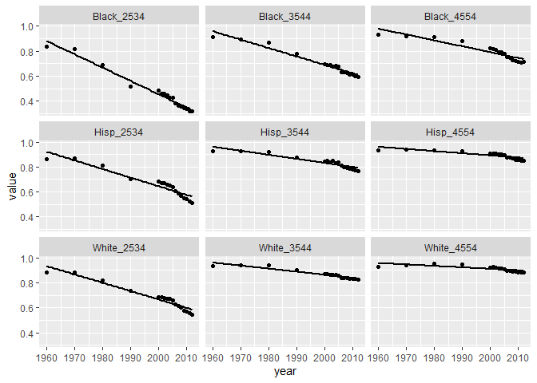
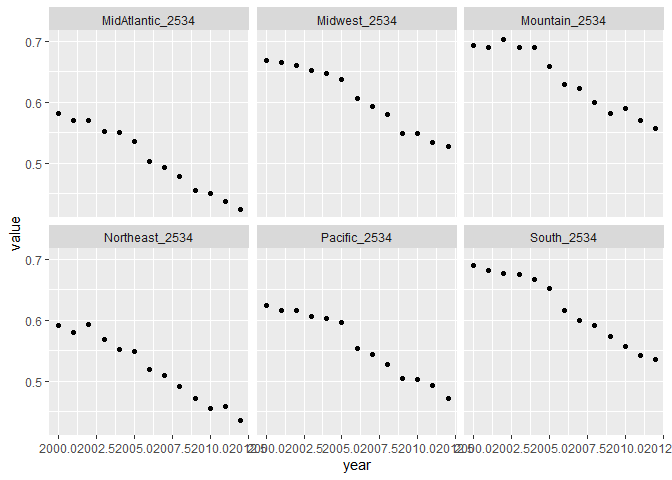

## Overview


In his article [Marriage Isn't Dead Yet](https://fivethirtyeight.com/features/marriage-isnt-dead-yet/), Ben Casselman explores the current trends in marriage and divorce rates as compared to previous decades along a variety of different demographic categories (sex, age, race, education level, income, region, and children status).

Most of the analysis is comparing education and income to marriage rates and how that impacts the marriage rate of the different age cohorts. His ultimate conclusion is that marriage is not yet dead and people are mostly getting married later in their lives than in the past.  

## Load Data

Let's take a look at the underlying data Casselman used in his article by pulling it from the fivethirtyeight Github.    


```r
urlcsv ="https://raw.githubusercontent.com/fivethirtyeight/data/master/marriage/both_sexes.csv"
data <- data.frame(read.csv(url(urlcsv)))
```

## Transform Data

First, we'll take a look at the column headers and what the overall dataset looks like:  


```r
colnames(data)
```

```
##  [1] "X"                "year"             "date"             "all_2534"        
##  [5] "HS_2534"          "SC_2534"          "BAp_2534"         "BAo_2534"        
##  [9] "GD_2534"          "White_2534"       "Black_2534"       "Hisp_2534"       
## [13] "NE_2534"          "MA_2534"          "Midwest_2534"     "South_2534"      
## [17] "Mountain_2534"    "Pacific_2534"     "poor_2534"        "mid_2534"        
## [21] "rich_2534"        "all_3544"         "HS_3544"          "SC_3544"         
## [25] "BAp_3544"         "BAo_3544"         "GD_3544"          "White_3544"      
## [29] "Black_3544"       "Hisp_3544"        "NE_3544"          "MA_3544"         
## [33] "Midwest_3544"     "South_3544"       "Mountain_3544"    "Pacific_3544"    
## [37] "poor_3544"        "mid_3544"         "rich_3544"        "all_4554"        
## [41] "HS_4554"          "SC_4554"          "BAp_4554"         "BAo_4554"        
## [45] "GD_4554"          "White_4554"       "Black_4554"       "Hisp_4554"       
## [49] "NE_4554"          "MA_4554"          "Midwest_4554"     "South_4554"      
## [53] "Mountain_4554"    "Pacific_4554"     "poor_4554"        "mid_4554"        
## [57] "rich_4554"        "nokids_all_2534"  "kids_all_2534"    "nokids_HS_2534"  
## [61] "nokids_SC_2534"   "nokids_BAp_2534"  "nokids_BAo_2534"  "nokids_GD_2534"  
## [65] "kids_HS_2534"     "kids_SC_2534"     "kids_BAp_2534"    "kids_BAo_2534"   
## [69] "kids_GD_2534"     "nokids_poor_2534" "nokids_mid_2534"  "nokids_rich_2534"
## [73] "kids_poor_2534"   "kids_mid_2534"    "kids_rich_2534"
```

The data is an already aggregated view of each demographic and represents the share of that column that has never married 

    Year | All_2534
    1960 | 0.1233145

  In this example 0.1233145 of the 25-34 age cohort in 1960 have never been married

The article does not look at race or region as a demographic so we'll take that subset of data and rename some of the region column header.


```r
data_subset <- data %>% 
    rename(c(Northeast_2534=NE_2534,MidAtlantic_2534=MA_2534,Northeast_3544=NE_3544,MidAtlantic_3544=MA_3544,Northeast_4554=NE_4554,MidAtlantic_4554=MA_4554)) %>%
    
    select(year,White_2534,Black_2534,Hisp_2534,White_3544,Black_3544,Hisp_3544,White_4554,Black_4554,Hisp_4554,Northeast_2534,MidAtlantic_2534,Midwest_2534,South_2534,Mountain_2534, Pacific_2534,Northeast_3544,MidAtlantic_3544, Midwest_3544, South_3544, Mountain_3544, Pacific_3544, Northeast_4554, MidAtlantic_4554,Midwest_4554, South_4554, Mountain_4554, Pacific_4554)
```


Now we can plot the change in marriage rates  

First, let's change the data to show the share of the cohort that **is** married (currently it shows who has **never** been married).  

This requires us to apply 1 - n to all the values in the data.  

Since the data is already aggregated, it will be easier to plot if it's into multiple datasets -  race / region by age


```r
married <- function(x) 1 - x

# change data to reflect marriage rate rather than non-married rate

data_subset_married <- data.frame(data_subset[1], apply(data_subset[2:28],2, married))

# split dataset into more manageable chunks

data_subset_race <- select(data_subset_married,year,White_2534,Black_2534,Hisp_2534,White_3544,Black_3544,Hisp_3544,White_4554,Black_4554,Hisp_4554)
data_subset_region_2534 <- select(data_subset_married,year,Northeast_2534,MidAtlantic_2534,Midwest_2534,South_2534,Mountain_2534, Pacific_2534)
```


Let's start looking at the data!  

Using some code found on [StackOverflow](https://stackoverflow.com/questions/9531904/plot-multiple-columns-on-the-same-graph-in-r), I was able to plot all the columns.  

### Racial Marriage Breakdown


```r
data_subset_race %>% tidyr::gather("id", "value", 2:10) %>% 
    ggplot(., aes(year, value))+
     geom_point()+
     geom_smooth(method = "lm", se=FALSE, color="black")+
     facet_wrap(~id)
```

```
## `geom_smooth()` using formula 'y ~ x'
```

<!-- -->

There is a clearly out-sized decrease in marriage rates among the black population relative to the other demographics.


The regional breakdown is hard to view with all the prior year data so it's simpler to restrict it to post 2000 data.

### Regional Marriage Breakdown post 2000


```r
data_subset_region_2534 %>% filter (year > 1999) %>% tidyr::gather("id", "value", 2:7) %>% 
     ggplot(., aes(year, value))+
     geom_point()+
     facet_wrap(~id)
```

<!-- -->

It appears like the Mid Atlantic and Northeast region dropped in marriage rates more than the other regions.


## Conclusions

While every demographic has seen a drop in marriage rates, there is clearly a larger drop within the black community. The regional differences are slight, but there could be more statistical analysis done to evaluate the apparent larger decreases in the Mid Atlantic and Northeast region. 


The work could be further extended with a more formal statistical review to see how the decreases compare across all the dimensions. There could also be additional dimensions to consider such as religion, which is an integral component of marriage, and is not explored in this dataset.  

$$\sum_x=1^10 x^2$$
