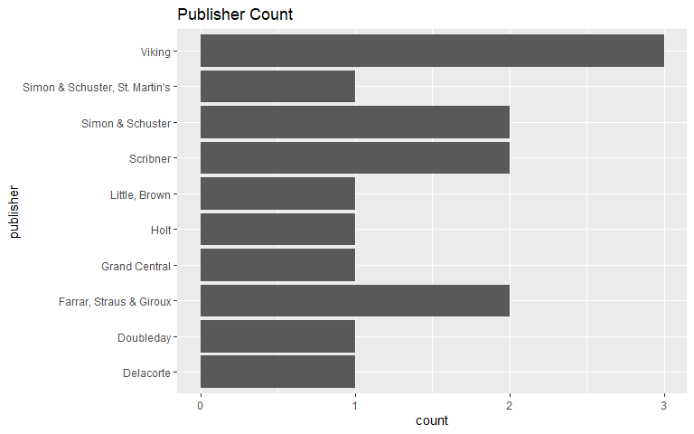
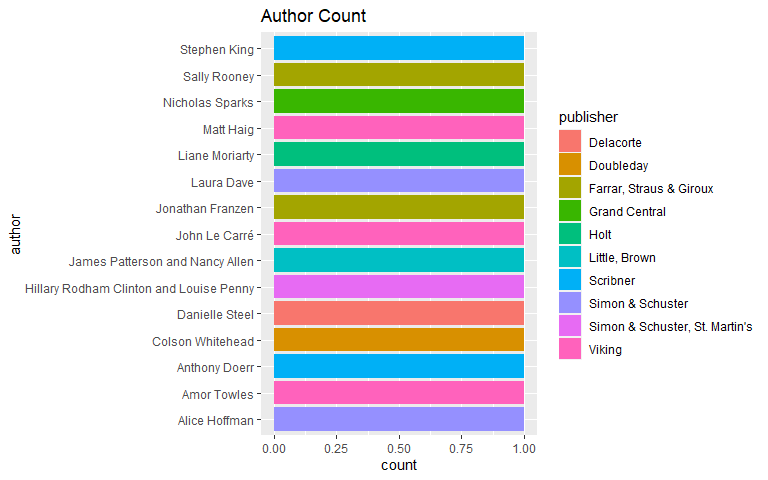

# Environment Variables and Libaries

  + keyring for secure API usage
  + jsonlite for reading in the JSON data from the API for reading the html file
  + tidyverse for dataframe manipulation and helper functions
  
# Overview & Approach

This assignment was to get familiar with using an API to read in data into a dataframe in R.

I first signed up for a developer account on [NYTimes](https://developer.nytimes.com/get-started).

My goal is to see if there are authors or publishers that are represented more often on the best seller list.


# Loading Data

After getting an API from NYTimes, I stored it in my R keyring and called for the latest best sellers list in `hardcover-fiction`


```r
api_call <- str_c("https://api.nytimes.com/svc/books/v3/lists/current/hardcover-fiction.json?api-key=",api_key)
books <- fromJSON(api_call)
glimpse(books)
```

```
## List of 5
##  $ status       : chr "OK"
##  $ copyright    : chr "Copyright (c) 2021 The New York Times Company.  All Rights Reserved."
##  $ num_results  : int 15
##  $ last_modified: chr "2021-10-20T22:17:49-04:00"
##  $ results      :List of 12
##   ..$ list_name                 : chr "Hardcover Fiction"
##   ..$ list_name_encoded         : chr "hardcover-fiction"
##   ..$ bestsellers_date          : chr "2021-10-16"
##   ..$ published_date            : chr "2021-10-31"
##   ..$ published_date_description: chr "latest"
##   ..$ next_published_date       : chr ""
##   ..$ previous_published_date   : chr "2021-10-24"
##   ..$ display_name              : chr "Hardcover Fiction"
##   ..$ normal_list_ends_at       : int 15
##   ..$ updated                   : chr "WEEKLY"
##   ..$ books                     :'data.frame':	15 obs. of  26 variables:
##   .. ..$ rank                : int [1:15] 1 2 3 4 5 6 7 8 9 10 ...
##   .. ..$ rank_last_week      : int [1:15] 0 2 1 3 5 0 8 0 6 7 ...
##   .. ..$ weeks_on_list       : int [1:15] 1 3 2 3 5 1 24 1 5 2 ...
##   .. ..$ asterisk            : int [1:15] 0 0 0 0 0 0 0 0 0 0 ...
##   .. ..$ dagger              : int [1:15] 0 0 0 0 0 0 0 0 0 0 ...
##   .. ..$ primary_isbn10      : chr [1:15] "198217367X" "1538728621" "0735222355" "1982168439" ...
##   .. ..$ primary_isbn13      : chr [1:15] "9781982173678" "9781538728628" "9780735222359" "9781982168438" ...
##   .. ..$ publisher           : chr [1:15] "Simon & Schuster, St. Martin's" "Grand Central" "Viking" "Scribner" ...
##   .. ..$ description         : chr [1:15] "In the wake of the previous administration’s mishandling of international affairs, the new Secretary of State E"| __truncated__ "Maggie Dawes, a renowned travel photographer, struggles with a medical diagnosis over Christmas." "Two friends who escaped from a juvenile work farm take Emmett Watson on an unexpected journey to New York City in 1954." "An interconnected cast of dreamers and outsiders are in dangerous and disparate settings past, present and future." ...
##   .. ..$ price               : chr [1:15] "0.00" "0.00" "0.00" "0.00" ...
##   .. ..$ title               : chr [1:15] "STATE OF TERROR" "THE WISH" "THE LINCOLN HIGHWAY" "CLOUD CUCKOO LAND" ...
##   .. ..$ author              : chr [1:15] "Hillary Rodham Clinton and Louise Penny" "Nicholas Sparks" "Amor Towles" "Anthony Doerr" ...
##   .. ..$ contributor         : chr [1:15] "by Hillary Rodham Clinton and Louise Penny" "by Nicholas Sparks" "by Amor Towles" "by Anthony Doerr" ...
##   .. ..$ contributor_note    : chr [1:15] "" "" "" "" ...
##   .. ..$ book_image          : chr [1:15] "https://storage.googleapis.com/du-prd/books/images/9781982173678.jpg" "https://storage.googleapis.com/du-prd/books/images/9781538728628.jpg" "https://storage.googleapis.com/du-prd/books/images/9780735222359.jpg" "https://storage.googleapis.com/du-prd/books/images/9781982168438.jpg" ...
##   .. ..$ book_image_width    : int [1:15] 331 330 331 331 329 331 331 336 329 328 ...
##   .. ..$ book_image_height   : int [1:15] 500 500 500 500 500 500 500 500 500 500 ...
##   .. ..$ amazon_product_url  : chr [1:15] "https://www.amazon.com/dp/198217367X?tag=NYTBSREV-20" "https://www.amazon.com/dp/1538728621?tag=NYTBSREV-20" "https://www.amazon.com/dp/0735222355?tag=NYTBSREV-20" "https://www.amazon.com/dp/1982168439?tag=NYTBSREV-20" ...
##   .. ..$ age_group           : chr [1:15] "" "" "" "" ...
##   .. ..$ book_review_link    : chr [1:15] "" "" "" "" ...
##   .. ..$ first_chapter_link  : chr [1:15] "" "" "" "" ...
##   .. ..$ sunday_review_link  : chr [1:15] "" "" "" "" ...
##   .. ..$ article_chapter_link: chr [1:15] "" "" "" "" ...
##   .. ..$ isbns               :List of 15
##   .. ..$ buy_links           :List of 15
##   .. ..$ book_uri            : chr [1:15] "nyt://book/ee38f9b9-6787-5e00-b068-7d2f712aa3fd" "nyt://book/28cad580-eb4e-512f-a790-9fd5eddd45d4" "nyt://book/43839b1f-c8cc-5ef4-8893-bd85582906a4" "nyt://book/d7de00f6-afc5-58c4-b106-0dcb33c8eed9" ...
##   ..$ corrections               : list()
```
It reads in a lot of extra information when I just want to see the latest set of books and publishers on the NYT list. So I'll create a tibble out of the books column in results:


```r
nyt_list <- books$results$books
glimpse(nyt_list)
```

```
## Rows: 15
## Columns: 26
## $ rank                 <int> 1, 2, 3, 4, 5, 6, 7, 8, 9, 10, 11, 12, 13, 14, 15
## $ rank_last_week       <int> 0, 2, 1, 3, 5, 0, 8, 0, 6, 7, 9, 4, 0, 13, 10
## $ weeks_on_list        <int> 1, 3, 2, 3, 5, 1, 24, 1, 5, 2, 11, 2, 45, 6, 4
## $ asterisk             <int> 0, 0, 0, 0, 0, 0, 0, 0, 0, 0, 0, 0, 0, 0, 0
## $ dagger               <int> 0, 0, 0, 0, 0, 0, 0, 0, 0, 0, 0, 0, 0, 0, 0
## $ primary_isbn10       <chr> "198217367X", "1538728621", "0735222355", "198216~
## $ primary_isbn13       <chr> "9781982173678", "9781538728628", "9780735222359"~
## $ publisher            <chr> "Simon & Schuster, St. Martin's", "Grand Central"~
## $ description          <chr> "In the wake of the previous administration’s mis~
## $ price                <chr> "0.00", "0.00", "0.00", "0.00", "0.00", "0.00", "~
## $ title                <chr> "STATE OF TERROR", "THE WISH", "THE LINCOLN HIGHW~
## $ author               <chr> "Hillary Rodham Clinton and Louise Penny", "Nicho~
## $ contributor          <chr> "by Hillary Rodham Clinton and Louise Penny", "by~
## $ contributor_note     <chr> "", "", "", "", "", "", "", "", "", "", "", "", "~
## $ book_image           <chr> "https://storage.googleapis.com/du-prd/books/imag~
## $ book_image_width     <int> 331, 330, 331, 331, 329, 331, 331, 336, 329, 328,~
## $ book_image_height    <int> 500, 500, 500, 500, 500, 500, 500, 500, 500, 500,~
## $ amazon_product_url   <chr> "https://www.amazon.com/dp/198217367X?tag=NYTBSRE~
## $ age_group            <chr> "", "", "", "", "", "", "", "", "", "", "", "", "~
## $ book_review_link     <chr> "", "", "", "", "", "", "", "", "", "", "", "", "~
## $ first_chapter_link   <chr> "", "", "", "", "", "", "", "", "", "", "", "", "~
## $ sunday_review_link   <chr> "", "", "", "", "", "", "", "", "", "", "", "", "~
## $ article_chapter_link <chr> "", "", "", "", "", "", "", "", "", "", "", "", "~
## $ isbns                <list> [<data.frame[2 x 2]>], [<data.frame[1 x 2]>], [<d~
## $ buy_links            <list> [<data.frame[6 x 2]>], [<data.frame[6 x 2]>], [<d~
## $ book_uri             <chr> "nyt://book/ee38f9b9-6787-5e00-b068-7d2f712aa3fd"~
```

# Publisher Analysis


```r
nyt_list %>% ggplot(aes(x=publisher)) + geom_histogram(stat = "count") + coord_flip() + ggtitle("Publisher Count")
```

```
## Warning: Ignoring unknown parameters: binwidth, bins, pad
```

<!-- -->
Viking and Simon & Schuster both have 3 books on the list when you include the duo Simon & Schuster, St Martin's entry.

# Author Analysis


```r
nyt_list %>% ggplot(aes(x=author,fill = publisher)) + geom_histogram(stat = "count") + coord_flip() + ggtitle("Author Count")
```

```
## Warning: Ignoring unknown parameters: binwidth, bins, pad
```

<!-- -->

# Conclusion and Next Steps

  + Publishers
    + Viking and Simon & Schuster are the most represented
  + Authors
    + No author currently has more than one book on the best sellers list.

We could extend this to include a years worth of data for every week and then plot out which publishers are highly represente on the NYT list as well as which authors have been successful on the list. We could also look at the running length of time they are on the NYT list (`weeks_on_list`) and see what impact author / publisher has on that metric.
