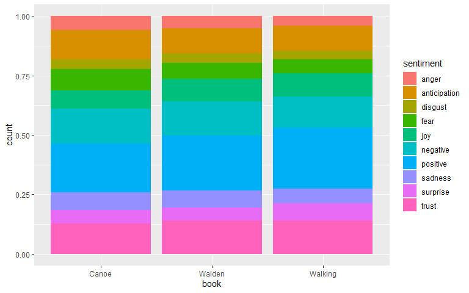

# Recreate Sentiment Analysis
Following code from [tidy text mining](https://www.tidytextmining.com/sentiment.html)

## Store Chapter Information

The following code splits out every word within the Jane Austen books to identify what chapter and line they belong to.


```r
tidy_books <- austen_books() %>%
  group_by(book) %>%
  mutate(
    linenumber = row_number(),
    chapter = cumsum(str_detect(text, 
                                regex("^chapter [\\divxlc]", 
                                      ignore_case = TRUE)))) %>%
  ungroup() %>%
  unnest_tokens(word, text)
```


## Check for joy-tagged words

Here we look for words that are tagged as `joy` and show how often they appear in _Emma_


```r
nrc_joy <- get_sentiments("nrc") %>% 
  filter(sentiment == "joy")

tidy_books %>%
  filter(book == "Emma") %>%
  inner_join(nrc_joy) %>%
  count(word, sort = TRUE)
```

```
## Joining, by = "word"
```

```
## # A tibble: 301 x 2
##    word          n
##    <chr>     <int>
##  1 good        359
##  2 friend      166
##  3 hope        143
##  4 happy       125
##  5 love        117
##  6 deal         92
##  7 found        92
##  8 present      89
##  9 kind         82
## 10 happiness    76
## # ... with 291 more rows
```

## Organize by Line Groups

Using the BING sentiment lexicon, classify each group of 80 lines in all the Austen books by sentiment. We can then plot how the sentiment changes over time.


```r
jane_austen_sentiment <- tidy_books %>%
  inner_join(get_sentiments("bing")) %>%
  count(book, index = linenumber %/% 80, sentiment) %>%
  pivot_wider(names_from = sentiment, values_from = n, values_fill = 0) %>% 
  mutate(sentiment = positive - negative)
```

```
## Joining, by = "word"
```


### plot


```r
ggplot(jane_austen_sentiment, aes(index, sentiment, fill = book)) +
  geom_col(show.legend = FALSE) +
  facet_wrap(~book, ncol = 2, scales = "free_x")
```

<!-- -->

## Compare Lexicons

Looking at just one book, _Pride & Prejudice_ and seeing how the different lexicons (`AFINN`, `BING`, and `NRC`) classify each word.


```r
pride_prejudice <- tidy_books %>% 
  filter(book == "Pride & Prejudice")
```


### AFINN, BING and NRC


```r
afinn <- pride_prejudice %>% 
  inner_join(get_sentiments("afinn")) %>% 
  group_by(index = linenumber %/% 80) %>% 
  summarise(sentiment = sum(value)) %>% 
  mutate(method = "AFINN")
```

```
## Joining, by = "word"
```

```r
bing_and_nrc <- bind_rows(
  pride_prejudice %>% 
    inner_join(get_sentiments("bing")) %>%
    mutate(method = "Bing et al."),
  pride_prejudice %>% 
    inner_join(get_sentiments("nrc") %>% 
                 filter(sentiment %in% c("positive", 
                                         "negative"))) %>%
    mutate(method = "NRC")) %>%
  count(method, index = linenumber %/% 80, sentiment) %>%
  pivot_wider(names_from = sentiment,
              values_from = n,
              values_fill = 0) %>% 
  mutate(sentiment = positive - negative)
```

```
## Joining, by = "word"
## Joining, by = "word"
```


```r
bind_rows(afinn, 
          bing_and_nrc) %>%
  ggplot(aes(index, sentiment, fill = method)) +
  geom_col(show.legend = FALSE) +
  facet_wrap(~method, ncol = 1, scales = "free_y")
```

<!-- -->

The trends seem consistent through the book, but the absolute values are clearly different. This is especially clear around the 75 mark where `NRC` and `AFINN` stay positive, but `BING` drops to the negative.


## Analysis

### NRC Positive / Negative

```r
get_sentiments("nrc") %>% 
  filter(sentiment %in% c("positive", "negative")) %>% 
  count(sentiment)
```

```
## # A tibble: 2 x 2
##   sentiment     n
##   <chr>     <int>
## 1 negative   3318
## 2 positive   2308
```

### BING word counts


```r
bing_word_counts <- tidy_books %>%
  inner_join(get_sentiments("bing")) %>%
  count(word, sentiment, sort = TRUE) %>%
  ungroup()
```

```
## Joining, by = "word"
```


## Plot Word Count


```r
bing_word_counts %>%
  group_by(sentiment) %>%
  slice_max(n, n = 10) %>% 
  ungroup() %>%
  mutate(word = reorder(word, n)) %>%
  ggplot(aes(n, word, fill = sentiment)) +
  geom_col(show.legend = FALSE) +
  facet_wrap(~sentiment, scales = "free_y") +
  labs(x = "Contribution to sentiment",
       y = NULL)
```

<!-- -->


## stopwords

Stop words are words that are ignored for classification purposes. We add `miss` to our stop words because it is being classified as _negative_ when it's simply a title for a name.


```r
custom_stop_words <- bind_rows(tibble(word = c("miss"),  
                                      lexicon = c("custom")), 
                               stop_words)

custom_stop_words
```

```
## # A tibble: 1,150 x 2
##    word        lexicon
##    <chr>       <chr>  
##  1 miss        custom 
##  2 a           SMART  
##  3 a's         SMART  
##  4 able        SMART  
##  5 about       SMART  
##  6 above       SMART  
##  7 according   SMART  
##  8 accordingly SMART  
##  9 across      SMART  
## 10 actually    SMART  
## # ... with 1,140 more rows
```

## Wordcloud

Most commonly found stopwords within the text.


```r
tidy_books %>%
  anti_join(stop_words) %>%
  count(word) %>%
  with(wordcloud(word, n, max.words = 100))
```

```
## Joining, by = "word"
```

<!-- -->

Word clouds by sentiment using `BING` lexicon

```r
tidy_books %>%
  inner_join(get_sentiments("bing")) %>%
  count(word, sentiment, sort = TRUE) %>%
  acast(word ~ sentiment, value.var = "n", fill = 0) %>%
  comparison.cloud(colors = c("gray20", "gray80"),
                   max.words = 100)
```

```
## Joining, by = "word"
```

<!-- -->


## Analysis by Sentences


```r
p_and_p_sentences <- tibble(text = prideprejudice) %>% 
  unnest_tokens(sentence, text, token = "sentences")
```


## Chapters

Here we count the number of chapters in each book in order to later classify a chapter as `positive` or `negative`


```r
austen_chapters <- austen_books() %>%
  group_by(book) %>%
  unnest_tokens(chapter, text, token = "regex", 
                pattern = "Chapter|CHAPTER [\\dIVXLC]") %>%
  ungroup()

austen_chapters %>% 
  group_by(book) %>% 
  summarise(chapters = n())
```

```
## # A tibble: 6 x 2
##   book                chapters
##   <fct>                  <int>
## 1 Sense & Sensibility       51
## 2 Pride & Prejudice         62
## 3 Mansfield Park            49
## 4 Emma                      56
## 5 Northanger Abbey          32
## 6 Persuasion                25
```

### Negative Chapters


```r
bingnegative <- get_sentiments("bing") %>% 
  filter(sentiment == "negative")

wordcounts <- tidy_books %>%
  group_by(book, chapter) %>%
  summarize(words = n())
```

```
## `summarise()` has grouped output by 'book'. You can override using the `.groups` argument.
```

```r
tidy_books %>%
  semi_join(bingnegative) %>%
  group_by(book, chapter) %>%
  summarize(negativewords = n()) %>%
  left_join(wordcounts, by = c("book", "chapter")) %>%
  mutate(ratio = negativewords/words) %>%
  filter(chapter != 0) %>%
  slice_max(ratio, n = 1) %>% 
  ungroup()
```

```
## Joining, by = "word"
## `summarise()` has grouped output by 'book'. You can override using the `.groups` argument.
```

```
## # A tibble: 6 x 5
##   book                chapter negativewords words  ratio
##   <fct>                 <int>         <int> <int>  <dbl>
## 1 Sense & Sensibility      43           161  3405 0.0473
## 2 Pride & Prejudice        34           111  2104 0.0528
## 3 Mansfield Park           46           173  3685 0.0469
## 4 Emma                     15           151  3340 0.0452
## 5 Northanger Abbey         21           149  2982 0.0500
## 6 Persuasion                4            62  1807 0.0343
```

Silge, Julia, and David Robinson. “Text Mining With R.” Tidy Text Mining, O’Reilly, 18 July 2017, www.tidytextmining.com/sentiment.html.

# Analyzing Different Corpus

I want to analyze the sentiment on Henry David Thoreau and a selection of three books freely available from the Gutenburg Project

  + [Walden, and On The Duty Of Civil Disobedience](https://www.gutenberg.org/ebooks/205)
  + [Canoeing in the Wilderness](https://www.gutenberg.org/ebooks/34990)
  + [Walking](https://www.gutenberg.org/ebooks/1022)


## Download Books

```r
canoe <- gutenberg_download(34990) # "Canoeing in the wilderness"
```

```
## Determining mirror for Project Gutenberg from http://www.gutenberg.org/robot/harvest
```

```
## Using mirror http://aleph.gutenberg.org
```

```r
walden <- gutenberg_download(205) #Walden, and On The Duty Of Civil Disobedience
walking <- gutenberg_download(1022) #Walking
```


## Data Transformation

convert book data into a set of line numbers and chapters


```r
canoe <- canoe %>%
  mutate(
    linenumber = row_number(),
    chapter = cumsum(str_detect(text, 
                                regex("^chapter [\\divxlc]", 
                                      ignore_case = TRUE)))) %>%
  ungroup() %>%
  unnest_tokens(word, text)

walden <- walden %>%
  mutate(
    linenumber = row_number(),
    chapter = cumsum(str_detect(text, 
                                regex("^chapter [\\divxlc]", 
                                      ignore_case = TRUE)))) %>%
  ungroup() %>%
  unnest_tokens(word, text)

walking <- walking %>%
  mutate(
    linenumber = row_number(),
    chapter = cumsum(str_detect(text, 
                                regex("^chapter [\\divxlc]", 
                                      ignore_case = TRUE)))) %>%
  ungroup() %>%
  unnest_tokens(word, text)
```


## Get Sentiment


```r
canoe_sentiment <- canoe %>%
    inner_join(get_sentiments("nrc")) %>%
    mutate(book = "Canoe")
```

```
## Joining, by = "word"
```

```r
walden_sentiment <- walden %>%
    inner_join(get_sentiments("nrc")) %>%
    mutate(book = "Walden") 
```

```
## Joining, by = "word"
```

```r
walking_sentiment <- walking %>%
    inner_join(get_sentiments("nrc")) %>%
    mutate(book = "Walking")
```

```
## Joining, by = "word"
```

```r
#combine

thoreau_sentiments <- rbind(canoe_sentiment,walden_sentiment,walking_sentiment)
```

## Plot


```r
canoe_sentiment %>% ggplot(aes(x=sentiment)) + geom_histogram(stat = "count")
```

```
## Warning: Ignoring unknown parameters: binwidth, bins, pad
```

<!-- -->

```r
walden_sentiment %>% ggplot(aes(x=sentiment)) + geom_histogram(stat = "count")
```

```
## Warning: Ignoring unknown parameters: binwidth, bins, pad
```

<!-- -->

```r
walking_sentiment %>% ggplot(aes(x=sentiment)) + geom_histogram(stat = "count")
```

```
## Warning: Ignoring unknown parameters: binwidth, bins, pad
```

<!-- -->

```r
thoreau_sentiments %>% ggplot(aes(fill=sentiment,x=book)) + geom_bar(position = "fill")
```

<!-- -->

Would be easier to hone in on a few key emotions that pop up the most


```r
thoreau_sentiments %>% filter(sentiment %in% c("fear","joy","anticipation","trust")) %>% ggplot(aes(fill=sentiment,x=book)) + geom_bar(position = "fill")
```

<!-- -->

## conclusion, findings, and recommendations


### Outcomes

It's clear there is more fear and anticipation in the Canoeing in the wilderness book and the least amount of fear exists in the Walking book. This intuitively makes sense since there is less risk walking versus canoeing in the wilderness. 


### Lexicon Comparison

I felt the most useful lexicon was the NRC lexicon because it gave a broader range of sentiments compared to BING and AFINN. While the numerical ranges would be nice to get from AFINN, I wanted to see the proportion of different emotions that existed in the three Walden books.

### Recommendations

We could do more statistical analysis and check if the differences in types of emotions is statistically significant. We could also check the other lexicons and compare if the positive / negative outcomes occur in a similar fashion to what happened with the Jane Austen books. Henry David Thoreau wrote his book not too much later than Jane Austen so some of the potential linguistic changes that have occured since they may not be appropriately represented in the lexicons.


```
