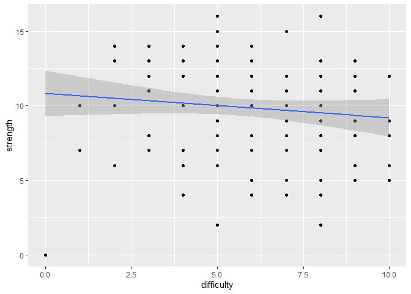

# League of Legends Dataset 1


## Data Storage

### Read in JSON file


Here we read in the data from the League of Legends [website](https://ddragon.leagueoflegends.com/cdn/11.19.1/data/en_US/champion.json) and create a tibble from the JSON for easier use within R

```r
champ_data <- fromJSON("https://ddragon.leagueoflegends.com/cdn/11.19.1/data/en_US/champion.json")

# 
champ_df <- tribble(~name,~attack,~defense,~difficulty,~tags,
                    "Starter", 0, 0, 0, "Fighter, Mage")
```

### Convert JSON to Dataframe

Iterate through the JSON file and pull the columns into the tibble we created.


```r
for (champ in champ_data$data) { 
  # names
 champ_df <- champ_df %>% add_row(name = champ[4]$name, attack = champ[[7]][1]$attack, defense = champ[[7]][2]$defense, difficulty = champ[[7]][4]$difficulty, tags =  paste(champ[9]$tags, collapse = ", "))
}

#remove dummy row:
champ_df <- champ_df[2:nrow(champ_df),]
```


### Write to CSV


```r
output_filename <- str_c(getwd(), "/champions.csv")

write.csv(champ_df,output_filename)
```


## Importing and Preparing Data

Let's take a look at our data 


```r
champ <- read.csv(output_filename)

head(champ)
```

```
##   X    name attack defense difficulty               tags
## 1 1  Aatrox      8       4          4      Fighter, Tank
## 2 2    Ahri      3       4          5     Mage, Assassin
## 3 3   Akali      5       3          7           Assassin
## 4 4  Akshan      0       0          0 Marksman, Assassin
## 5 5 Alistar      6       9          7      Tank, Support
## 6 6   Amumu      2       6          3         Tank, Mage
```
### Set Row Names


```r
row.names(champ) <- champ$name
```

This is already pretty clean, but we should normalize some of the `tags` data so that we can do more analysis later on. 

I'm going to keep things simple for now and simply take the first tag as the canonical `primary_role` and the second as the `secondary_role`


```r
primary_role <- c()
secondary_role <- c()
for (tag in champ$tags) {
  roles <- tag %>% str_split(",")
  primary_role <- c(primary_role, roles[[1]][1] %>% trimws())
  secondary_role <- c(secondary_role, roles[[1]][length(roles[[1]])] %>% trimws())
}

champ <- champ %>% add_column(primary_role = primary_role, secondary_role = secondary_role)

head(champ)
```

```
##         X    name attack defense difficulty               tags primary_role
## Aatrox  1  Aatrox      8       4          4      Fighter, Tank      Fighter
## Ahri    2    Ahri      3       4          5     Mage, Assassin         Mage
## Akali   3   Akali      5       3          7           Assassin     Assassin
## Akshan  4  Akshan      0       0          0 Marksman, Assassin     Marksman
## Alistar 5 Alistar      6       9          7      Tank, Support         Tank
## Amumu   6   Amumu      2       6          3         Tank, Mage         Tank
##         secondary_role
## Aatrox            Tank
## Ahri          Assassin
## Akali         Assassin
## Akshan        Assassin
## Alistar        Support
## Amumu             Mage
```

```r
# drop extra column

champ <- champ[,2:length(champ)]
```


This allows us to perform more data analysis later.

Let's also create a new column called `strength` so we can compare the summation of a champions attack and defense.


```r
champ <- champ %>% mutate(strength = attack + defense)
```


## Data Analysis

We can do some some high level sorting to get a sense of the 5 weakest champions and the 5 strongest champions by each category

### Strength by primary_role


```r
champ %>% group_by(primary_role) %>% summarize(max = max(strength), min = min(strength), mean = mean(strength), stdev = sd(strength), count = n())
```

```
## # A tibble: 6 x 6
##   primary_role   max   min  mean stdev count
##   <chr>        <int> <int> <dbl> <dbl> <int>
## 1 Assassin        14     2  9.56  3.24    18
## 2 Fighter         16     2 12.6   2.17    43
## 3 Mage            11     0  5.89  2.46    35
## 4 Marksman        16     0 10.7   2.83    26
## 5 Support         12     6  8.8   2.34    15
## 6 Tank            15     0 11.4   3.25    20
```


### Attack by primary_role


```r
champ %>% group_by(primary_role) %>% summarize(max = max(attack), min = min(attack), mean = mean(attack), stdev = sd(attack), count = n())
```

```
## # A tibble: 6 x 6
##   primary_role   max   min  mean stdev count
##   <chr>        <int> <int> <dbl> <dbl> <int>
## 1 Assassin        10     0  6     2.89    18
## 2 Fighter         10     0  7.30  1.87    43
## 3 Mage             6     0  2.31  1.59    35
## 4 Marksman        10     0  7.81  1.98    26
## 5 Support          9     2  3.87  1.77    15
## 6 Tank             6     0  3.85  1.60    20
```
I'm surprise that Supports come out higher than Mages on attack as Mages should in theory have more attacking power than a Support class champion.  
### Defense by primary_role


```r
champ %>% group_by(primary_role) %>% summarize(max = max(defense), min = min(defense), mean = mean(defense), stdev = sd(defense), count = n())
```

```
## # A tibble: 6 x 6
##   primary_role   max   min  mean stdev count
##   <chr>        <int> <int> <dbl> <dbl> <int>
## 1 Assassin         5     2  3.56 0.922    18
## 2 Fighter          7     2  5.26 1.16     43
## 3 Mage             7     0  3.57 1.85     35
## 4 Marksman         6     0  2.85 1.41     26
## 5 Support          9     1  4.93 2.34     15
## 6 Tank            10     0  7.55 2.16     20
```
Understandly, Tanks come out with the highest defense.

We can add a third dimension, `difficulty` by adding in a scatter plot to get a graphical sense of the data.


```r
champ %>% ggplot(aes(x=difficulty, y=strength, color = primary_role)) + geom_point() 
```

<!-- -->
It's hard to tell if strength increases as difficulty increases, so we can also split out the graphs by the role to get a better sense of it


```r
champ %>% filter(primary_role == "Fighter") %>% ggplot(aes(x=difficulty, y=strength, color = primary_role)) + geom_point() + geom_smooth(method=lm) + facet_wrap(~primary_role)
```

```
## `geom_smooth()` using formula 'y ~ x'
```

<!-- -->


# Child Mortality Rates Dataset 2


```r
output_filename <- str_c(getwd(), "/champions.csv")

write.csv(champ_df,output_filename)
```

## Importing and Preparing Data


## Data Analysis

## Importing and Preparing Data
