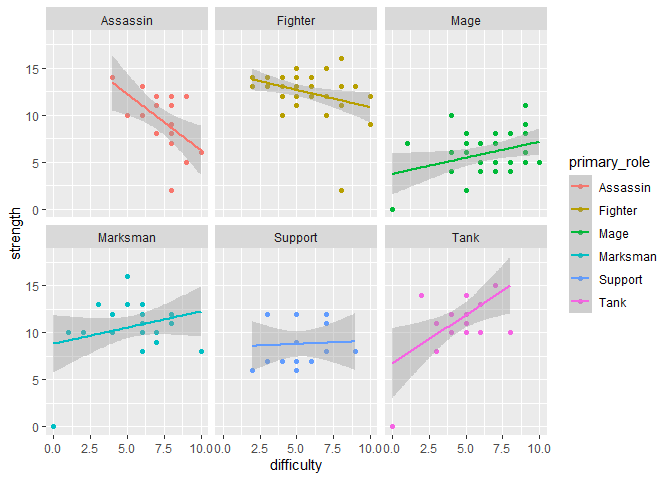
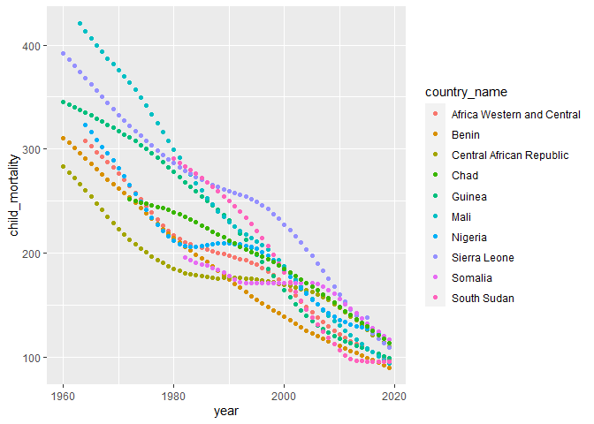
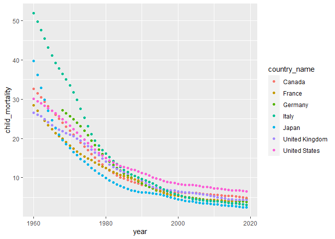
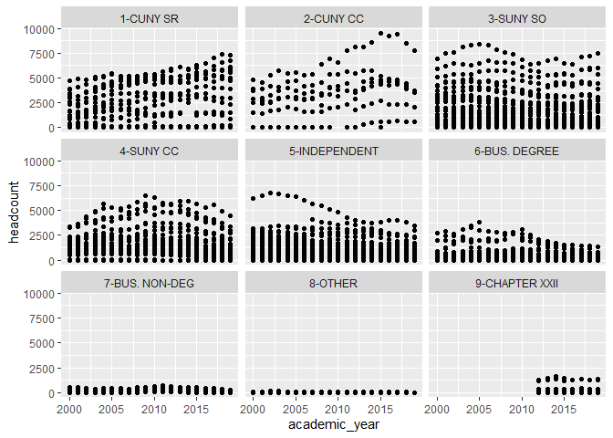
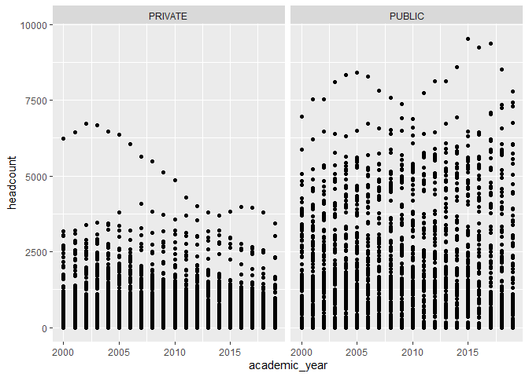
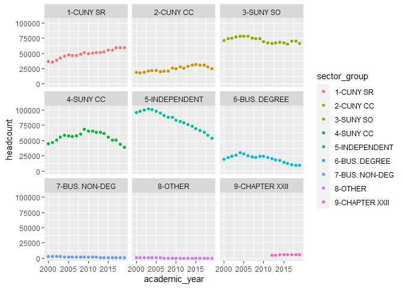
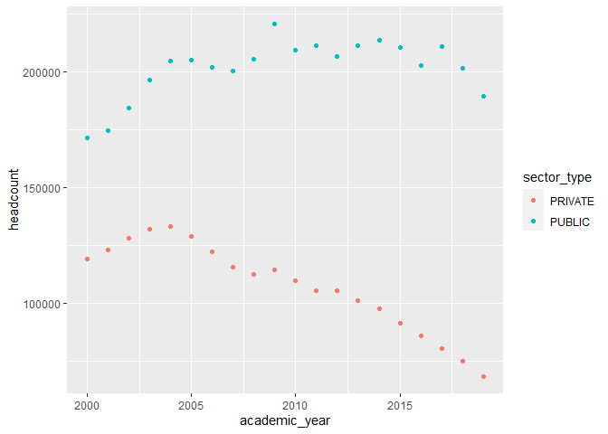
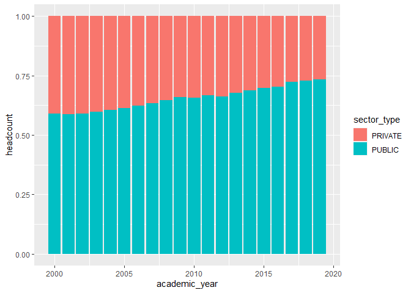

# League of Legends Dataset 1


## Data Storage

### Read in JSON file


Here we read in the data from the League of Legends [website](https://ddragon.leagueoflegends.com/cdn/11.19.1/data/en_US/champion.json) and create a tibble from the JSON for easier use within R

```r
champ_data <- fromJSON("https://ddragon.leagueoflegends.com/cdn/11.19.1/data/en_US/champion.json")

# 
champ_df <- tribble(~name,~attack,~defense,~difficulty,~tags,
                    "Starter", 0, 0, 0, "Fighter, Mage")
```

### Convert JSON to Dataframe

Iterate through the JSON file and pull the columns into the tibble we created.


```r
for (champ in champ_data$data) { 
  # names
 champ_df <- champ_df %>% add_row(name = champ[4]$name, attack = champ[[7]][1]$attack, defense = champ[[7]][2]$defense, difficulty = champ[[7]][4]$difficulty, tags =  paste(champ[9]$tags, collapse = ", "))
}

#remove dummy row:
champ_df <- champ_df[2:nrow(champ_df),]
```


### Write to CSV


```r
output_filename <- str_c(getwd(), "/champions.csv")

write.csv(champ_df,output_filename)
```


## Importing and Preparing Data

Let's take a look at our data 


```r
champ <- read.csv(output_filename)

head(champ)
```

```
##   X    name attack defense difficulty               tags
## 1 1  Aatrox      8       4          4      Fighter, Tank
## 2 2    Ahri      3       4          5     Mage, Assassin
## 3 3   Akali      5       3          7           Assassin
## 4 4  Akshan      0       0          0 Marksman, Assassin
## 5 5 Alistar      6       9          7      Tank, Support
## 6 6   Amumu      2       6          3         Tank, Mage
```
### Set Row Names


```r
row.names(champ) <- champ$name
```


### Tidy and Prep Data

This is already pretty clean, but we should normalize some of the `tags` data so that we can do more analysis later on. 

I'm going to keep things simple for now and simply take the first tag as the canonical `primary_role` and the second as the `secondary_role`


```r
primary_role <- c()
secondary_role <- c()
for (tag in champ$tags) {
  roles <- tag %>% str_split(",")
  primary_role <- c(primary_role, roles[[1]][1] %>% trimws())
  secondary_role <- c(secondary_role, roles[[1]][length(roles[[1]])] %>% trimws())
}

champ <- champ %>% add_column(primary_role = primary_role, secondary_role = secondary_role)

head(champ)
```

```
##         X    name attack defense difficulty               tags primary_role
## Aatrox  1  Aatrox      8       4          4      Fighter, Tank      Fighter
## Ahri    2    Ahri      3       4          5     Mage, Assassin         Mage
## Akali   3   Akali      5       3          7           Assassin     Assassin
## Akshan  4  Akshan      0       0          0 Marksman, Assassin     Marksman
## Alistar 5 Alistar      6       9          7      Tank, Support         Tank
## Amumu   6   Amumu      2       6          3         Tank, Mage         Tank
##         secondary_role
## Aatrox            Tank
## Ahri          Assassin
## Akali         Assassin
## Akshan        Assassin
## Alistar        Support
## Amumu             Mage
```

```r
# drop extra column

champ <- champ[,2:length(champ)]
```


This allows us to perform more data analysis later.

Let's also create a new column called `strength` so we can compare the summation of a champions attack and defense.


```r
champ <- champ %>% mutate(strength = attack + defense)
```


## Data Analysis

We can do some some high level sorting to get a sense of the strength of each role

### Strength by primary_role


```r
champ %>% group_by(primary_role) %>% summarize(max = max(strength), min = min(strength), mean = mean(strength), stdev = sd(strength), count = n())
```

```
## # A tibble: 6 x 6
##   primary_role   max   min  mean stdev count
##   <chr>        <int> <int> <dbl> <dbl> <int>
## 1 Assassin        14     2  9.56  3.24    18
## 2 Fighter         16     2 12.6   2.17    43
## 3 Mage            11     0  5.89  2.46    35
## 4 Marksman        16     0 10.7   2.83    26
## 5 Support         12     6  8.8   2.34    15
## 6 Tank            15     0 11.4   3.25    20
```

It seems like the strongest groups are Fighters and Tanks, with Fighter's slightly edging out to due a higher mean and a lower spread.


### Attack by primary_role


```r
champ %>% group_by(primary_role) %>% summarize(max = max(attack), min = min(attack), mean = mean(attack), stdev = sd(attack), count = n())
```

```
## # A tibble: 6 x 6
##   primary_role   max   min  mean stdev count
##   <chr>        <int> <int> <dbl> <dbl> <int>
## 1 Assassin        10     0  6     2.89    18
## 2 Fighter         10     0  7.30  1.87    43
## 3 Mage             6     0  2.31  1.59    35
## 4 Marksman        10     0  7.81  1.98    26
## 5 Support          9     2  3.87  1.77    15
## 6 Tank             6     0  3.85  1.60    20
```


I'm surprised that Supports come out higher than Mages on attack as Mages should in theory have more attacking power than a Support class champion.  


### Defense by primary_role


```r
champ %>% group_by(primary_role) %>% summarize(max = max(defense), min = min(defense), mean = mean(defense), stdev = sd(defense), count = n())
```

```
## # A tibble: 6 x 6
##   primary_role   max   min  mean stdev count
##   <chr>        <int> <int> <dbl> <dbl> <int>
## 1 Assassin         5     2  3.56 0.922    18
## 2 Fighter          7     2  5.26 1.16     43
## 3 Mage             7     0  3.57 1.85     35
## 4 Marksman         6     0  2.85 1.41     26
## 5 Support          9     1  4.93 2.34     15
## 6 Tank            10     0  7.55 2.16     20
```
Understandly, Tanks come out with the highest defense.

We can add a third dimension, `difficulty` by adding in a scatter plot to get a graphical sense of the data.
### Difficulty by Strength


```r
champ %>% ggplot(aes(x=difficulty, y=strength)) + geom_point() + geom_smooth(method=lm)
```

```
## `geom_smooth()` using formula 'y ~ x'
```

<!-- -->

It looks like there is a slightly negative slope with strength as difficulty decreases. However, remembering Simpson's Paradox, we can stratify our data into the primary roles to see what happens when we evaluate it by role.


```r
champ %>% ggplot(aes(x=difficulty, y=strength, color = primary_role)) + geom_point() + geom_smooth(method=lm) + facet_wrap(~primary_role)
```

```
## `geom_smooth()` using formula 'y ~ x'
```

<!-- -->

You can see that Tanks increase in strength drastically as difficulty increases and Assassins actually drop drastically as difficulty increases.


## Overview and Conclusion

The assigned problem was to find the highest starting HP for each champion, but after taking a look at the data, I felt that a more insightful analysis would be to look at the relative strength of each champion role by its primary role. My key assumptions were as follows:

  + Strength is an additive representation of attack and defense (Attack + Defense).
  + A champion's primary role in the data is the first in the list of roles provided.
  
Based off of those assumptions, the strongest groups in League of Legends are Fighters and Tanks. 

We could do more statistical analysis to determine the exact correlation between strength and difficulty as well as more targeted analysis with the attack / defense characteristics.


# Child Mortality Rates Dataset 2

## Overview of Approach

Alec wants to answer the following questions with this dataset:

  + What 10 countries have the highest under-5 mortality rates today?
  + For the 10 worst countries, visualize the under-5 mortality trend over time.
  + Comparatively, what does the trend for G7 countries look like over time?

## Data Storage

I downloaded the data from [The World Bank](https://data.worldbank.org/indicator/SH.DYN.MORT) and uploaded the csv file to my GitHub account with a wide format (years as columns). The data is about Mortality rate, under-5 (per 1,000 live births)


## Importing and Preparing Data

```r
input_csv <- "https://raw.githubusercontent.com/sserrot/DATA607/main/Project%202/child_mortality_rates/API_SH.DYN.MORT_DS2_en_csv_v2_3012069.csv"
child_mort <- read.csv(input_csv, check.names = FALSE)
colnames(child_mort)
```

```
##  [1] "Country Name" "Country Code"    "1960"            "1961"           
##  [5] "1962"            "1963"            "1964"            "1965"           
##  [9] "1966"            "1967"            "1968"            "1969"           
## [13] "1970"            "1971"            "1972"            "1973"           
## [17] "1974"            "1975"            "1976"            "1977"           
## [21] "1978"            "1979"            "1980"            "1981"           
## [25] "1982"            "1983"            "1984"            "1985"           
## [29] "1986"            "1987"            "1988"            "1989"           
## [33] "1990"            "1991"            "1992"            "1993"           
## [37] "1994"            "1995"            "1996"            "1997"           
## [41] "1998"            "1999"            "2000"            "2001"           
## [45] "2002"            "2003"            "2004"            "2005"           
## [49] "2006"            "2007"            "2008"            "2009"           
## [53] "2010"            "2011"            "2012"            "2013"           
## [57] "2014"            "2015"            "2016"            "2017"           
## [61] "2018"            "2019"
```

### Renaming Column Headers


```r
child_mort <- child_mort %>% rename(country_name = "Country Name", country_code = "Country Code")

head(child_mort)
```

```
##                  country_name country_code 1960 1961  1962  1963     1964
## 1                       Aruba          ABW   NA   NA    NA    NA       NA
## 2 Africa Eastern and Southern          AFE   NA   NA    NA    NA       NA
## 3                 Afghanistan          AFG   NA   NA 344.6 338.7 333.1000
## 4  Africa Western and Central          AFW   NA   NA    NA    NA 308.3538
## 5                      Angola          AGO   NA   NA    NA    NA       NA
## 6                     Albania          ALB   NA   NA    NA    NA       NA
##      1965     1966     1967     1968     1969     1970     1971     1972
## 1      NA       NA       NA       NA       NA       NA       NA       NA
## 2      NA 225.0155 223.5800 217.2664 215.9640 214.6804 213.2826 211.8596
## 3 327.600 322.0000 316.8000 311.4000 305.8000 300.3000 294.8000 289.3000
## 4 302.621 296.9770 292.3835 287.3247 282.0977 276.5582 270.8868 264.4361
## 5      NA       NA       NA       NA       NA       NA       NA       NA
## 6      NA       NA       NA       NA       NA       NA       NA       NA
##       1973     1974     1975     1976     1977     1978     1979     1980
## 1       NA       NA       NA       NA       NA       NA       NA       NA
## 2 210.4980 209.1949 207.8382 206.4451 208.0446 206.0752 203.6648 201.1442
## 3 283.6000 277.8000 272.0000 266.2000 260.1000 254.0000 247.8000 241.5000
## 4 258.2149 251.8175 245.3530 238.8410 232.6551 226.5037 221.3595 216.9938
## 5       NA       NA       NA       NA       NA       NA       NA 237.3000
## 6       NA       NA       NA       NA       NA  96.2000  88.6000  81.6000
##       1981     1982     1983     1984     1985     1986     1987     1988
## 1       NA       NA       NA       NA       NA       NA       NA       NA
## 2 198.2946 195.4242 192.5879 189.9935 187.6373 185.5190 183.5605 181.6635
## 3 235.1000 228.6000 222.2000 215.8000 209.3000 202.9000 196.4000 190.1000
## 4 213.3552 210.4841 208.2598 206.4225 205.0015 203.4676 201.9991 200.5712
## 5 234.6000 231.9000 229.2000 227.1000 225.5000 224.3000 223.4000 222.8000
## 6  75.2000  69.2000  63.9000  59.2000  55.0000  51.3000  48.1000  45.4000
##       1989     1990     1991     1992     1993     1994     1995     1996
## 1       NA       NA       NA       NA       NA       NA       NA       NA
## 2 179.7603 164.7828 163.1123 161.4466 159.8275 159.5674 156.5530 152.7003
## 3 183.8000 177.7000 171.7000 165.9000 160.4000 155.2000 150.3000 145.6000
## 4 199.1289 197.6418 196.1599 194.6632 193.0719 191.2059 188.8381 186.0104
## 5 222.3000 222.2000 222.1000 222.1000 222.3000 221.9000 221.2000 219.7000
## 6  43.0000  41.0000  39.3000  37.8000  36.5000  35.2000  33.9000  32.6000
##       1997     1998     1999     2000     2001     2002     2003     2004
## 1       NA       NA       NA       NA       NA       NA       NA       NA
## 2 149.9071 146.5940 141.8681 136.9178 131.6704 126.1391 120.6360 115.2636
## 3 141.2000 136.9000 132.8000 128.7000 124.6000 120.4000 116.3000 112.1000
## 4 182.6339 178.7524 174.3547 169.5484 164.5338 159.2519 153.9163 148.5774
## 5 217.0000 213.5000 209.2000 203.9000 197.8000 190.9000 183.2000 174.6000
## 6  31.3000  29.9000  28.6000  27.2000  25.8000  24.4000  22.9000  21.4000
##       2005     2006     2007      2008      2009      2010      2011      2012
## 1       NA       NA       NA        NA        NA        NA        NA        NA
## 2 110.0601 105.1962 100.2764  95.39523  90.59822  86.20859  82.10519  78.35423
## 3 107.9000 103.7000  99.5000  95.40000  91.40000  87.60000  83.90000  80.30000
## 4 143.4174 138.5027 133.7695 129.48833 125.45049 121.78327 118.44269 115.49879
## 5 165.6000 156.2000 146.8000 137.40000 128.60000 120.30000 112.30000 105.00000
## 6  20.0000  18.5000  17.1000  15.80000  14.50000  13.20000  12.10000  11.20000
##       2013      2014      2015      2016      2017     2018     2019
## 1       NA        NA        NA        NA        NA       NA       NA
## 2  74.9916  71.99684  69.28895  66.66761  64.34702 62.11539 60.09866
## 3  76.8000  73.60000  70.40000  67.60000  64.90000 62.50000 60.30000
## 4 112.6679 110.26443 107.76570 105.05555 102.43068 99.59878 96.81424
## 5  98.6000  93.00000  88.20000  84.20000  80.60000 77.70000 74.70000
## 6  10.4000   9.90000   9.60000   9.40000   9.40000  9.50000  9.70000
```
### Lengthen the data


```r
child_mort <- child_mort %>% pivot_longer(cols = !c("country_name","country_code"),names_to = "year", names_transform = list(year = as.integer), values_to =  "child_mortality")

head(child_mort)
```

```
## # A tibble: 6 x 4
##   country_name country_code  year child_mortality
##   <chr>        <chr>        <int>           <dbl>
## 1 Aruba        ABW           1960              NA
## 2 Aruba        ABW           1961              NA
## 3 Aruba        ABW           1962              NA
## 4 Aruba        ABW           1963              NA
## 5 Aruba        ABW           1964              NA
## 6 Aruba        ABW           1965              NA
```

Aruba has no data so we can just look at the US to make sure we brought in the data as expected.


```r
child_mort %>% filter(country_code == "USA")
```

```
## # A tibble: 60 x 4
##    country_name  country_code  year child_mortality
##    <chr>         <chr>        <int>           <dbl>
##  1 United States USA           1960            30.1
##  2 United States USA           1961            29.5
##  3 United States USA           1962            28.9
##  4 United States USA           1963            28.3
##  5 United States USA           1964            27.7
##  6 United States USA           1965            27.1
##  7 United States USA           1966            26.4
##  8 United States USA           1967            25.7
##  9 United States USA           1968            24.9
## 10 United States USA           1969            24.1
## # ... with 50 more rows
```


## Data Analysis

### Question 1: What 10 countries have the highest under-5 mortality rates today?

Let's first find the most recent year that we have data for:


```r
 max(child_mort$year)
```

```
## [1] 2019
```

Let's filter the data for 2019 and slice the first 5 countries with the highest child mortality 


```r
child_mort %>% filter(year == 2019) %>% arrange(desc(child_mortality)) %>% slice(1:10)
```

```
## # A tibble: 10 x 4
##    country_name               country_code  year child_mortality
##    <chr>                      <chr>        <int>           <dbl>
##  1 Nigeria                    NGA           2019           117. 
##  2 Somalia                    SOM           2019           117  
##  3 Chad                       TCD           2019           114. 
##  4 Central African Republic   CAF           2019           110. 
##  5 Sierra Leone               SLE           2019           109. 
##  6 Guinea                     GIN           2019            98.8
##  7 Africa Western and Central AFW           2019            96.8
##  8 South Sudan                SSD           2019            96.2
##  9 Mali                       MLI           2019            94  
## 10 Benin                      BEN           2019            90.3
```

Let's store this in a list so we can reference these countries later.


```r
bottom_ten_code <- child_mort %>% filter(year == 2019) %>% arrange(desc(child_mortality)) %>% slice(1:10) %>% select(country_code)
```

### Question 2: For the 10 worst countries, visualize the under-5 mortality trend over time.

Since we have the list of the 10 countries with the worst child mortality, we can filter our original dataset and plot the trend of the data over time.

#### Filter


```r
child_mort_bottom_ten <- child_mort[child_mort$country_code %in% bottom_ten_code$country_code,]
```


#### Plot countries over time


```r
child_mort_bottom_ten %>% ggplot(aes(x=year,y=child_mortality, color = country_name)) + geom_point() 
```

```
## Warning: Removed 65 rows containing missing values (geom_point).
```

<!-- -->

It looks like all these countries have dropped their child mortality rates by between 1/2 to 1/4 since the data has been tracked. We can get the exact numbers from the following snippet of code:


```r
earliest_year <- child_mort_bottom_ten %>% drop_na() %>% group_by(country_name) %>% summarize(min_year = min(year))
```


### Question 3: Comparatively, what does the trend for G7 countries look like over time?

First, we have to find the list of G7 countries from [Wikipedia](https://en.wikipedia.org/wiki/Group_of_Seven)

Canada, France, Germany, Italy, Japan, the United Kingdom, and the United States:


```r
g_seven <- c("Canada", "France", "Germany", "Italy", "Japan","United Kingdom","United States")
```
#### Plot G7 over time


```r
child_mort %>% filter(country_name %in% g_seven) %>% ggplot(aes(x=year,y=child_mortality, color = country_name)) + geom_point() 
```

```
## Warning: Removed 8 rows containing missing values (geom_point).
```

<!-- -->

The G7 countries have also dropped their mortality rates by about 1/3 to 1/5, although their starting points are much lower relatively speaking.


# Tuition Assistance Program (TAP) Fall Headcount by College - 2020

## Overview of Approach

Bianka wants to answer the following questions with this dataset:

  + See recipient trends by academic year, by section type
  + Get percentage of students receiving TAP by sector type or academic year.

## Data Storage

I downloaded the data from [data.gov](https://catalog.data.gov/dataset/tuition-assistance-program-tap-fall-headcount-by-college-sector-group-and-level-of-study-b) and uploaded the csv file to my GitHub account. The data is about all the trees in NYC in 2015.

## Importing and Preparing Data


```r
input_csv <- "https://raw.githubusercontent.com/sserrot/DATA607/main/Project%202/tuition_assistance/Tuition_Assistance_Program__TAP__Fall_Headcount_By_College__Sector_Group__and_Level_of_Study___Beginning_2000.csv"
TAP  <- read.csv(input_csv, check.names = FALSE)
colnames(TAP)
```

```
## [1] "Academic Year"       "TAP College Code"    "Federal School Code"
## [4] "Level"               "TAP Level of Study"  "TAP College Name"   
## [7] "Sector Type"         "TAP Sector Group"    "TAP Fall Headcount"
```
### Rename headers


```r
TAP <- TAP %>% rename(academic_year = "Academic Year", tap_college_code = "TAP College Code", fed_school_code = "Federal School Code", level = Level, study_level = "TAP Level of Study", sector_type = "Sector Type", sector_group = "TAP Sector Group", headcount = "TAP Fall Headcount", tap_college_name = "TAP College Name")

head(TAP)
```

```
##   academic_year tap_college_code fed_school_code level    study_level
## 1          2019             8206           37133     U 4 yr Undergrad
## 2          2019              940            2849     U 4 yr Undergrad
## 3          2019              685            2816     U 4 yr Undergrad
## 4          2019             6020            2857     U 4 yr Undergrad
## 5          2019             2051            2713     U 4 yr Undergrad
## 6          2019             6093            2763     U 4 yr Undergrad
##                   tap_college_name sector_type   sector_group headcount
## 1       BEIS MEDRASH HEICHAL DOVID     PRIVATE 9-CHAPTER XXII        18
## 2     SUNY PLATTSBURGH (UNDERGRAD)      PUBLIC      3-SUNY SO      1936
## 3                    SIENA COLLEGE     PRIVATE  5-INDEPENDENT       872
## 4    SUNY COLLEGE OF TECH AT DELHI      PUBLIC      3-SUNY SO       557
## 5 DOMINICAN COLLEGE-WEEKEND 4YR UG     PRIVATE  5-INDEPENDENT         4
## 6               MARIA COLLEGE 4 YR     PRIVATE  5-INDEPENDENT        33
```

This data has already been converted to a long format, so there is not much more tidying to do.


## Data Analysis

### Question 1 See recipient trends by academic year, by sector type


Let's start by looking through the data


```r
unique(TAP$academic_year)
```

```
##  [1] 2019 2018 2017 2016 2015 2014 2013 2012 2011 2010 2009 2008 2007 2006 2005
## [16] 2004 2003 2002 2001 2000
```

We have data for the past 19 years, let's see the max headcount recipient per year


```r
TAP %>% group_by(academic_year, tap_college_name, sector_type) %>% summarize(largest_headcount_by_year = max(headcount)) %>% arrange(desc(largest_headcount_by_year))
```

```
## `summarise()` has grouped output by 'academic_year', 'tap_college_name'. You can override using the `.groups` argument.
```

```
## # A tibble: 7,295 x 4
## # Groups:   academic_year, tap_college_name [7,295]
##    academic_year tap_college_name              sector_type largest_headcount_by~
##            <int> <chr>                         <chr>                       <int>
##  1          2015 CUNY MANHATTAN CC             PUBLIC                       9529
##  2          2017 CUNY MANHATTAN CC             PUBLIC                       9365
##  3          2016 CUNY MANHATTAN CC             PUBLIC                       9250
##  4          2014 CUNY MANHATTAN CC             PUBLIC                       8604
##  5          2018 CUNY MANHATTAN CC             PUBLIC                       8509
##  6          2005 SUNY BUFFALO 4 YR (UNDERGRAD) PUBLIC                       8405
##  7          2004 SUNY BUFFALO 4 YR (UNDERGRAD) PUBLIC                       8323
##  8          2006 SUNY BUFFALO 4 YR (UNDERGRAD) PUBLIC                       8273
##  9          2012 CUNY MANHATTAN CC             PUBLIC                       8139
## 10          2013 CUNY MANHATTAN CC             PUBLIC                       8116
## # ... with 7,285 more rows
```

Largest headcount recipient ever was `CUNY MANHATTAN CC` in 2015.


how many colleges are there?


```r
length(unique(TAP$tap_college_name))
```

```
## [1] 571
```

That's a lot of colleges to represent in a single graph, so we should try to figure out a way to split out the dataset into a more manageable set of graphs.


```r
TAP %>% ggplot(aes(x=academic_year, y=headcount)) + geom_point() + facet_wrap(~sector_group)
```

<!-- -->

```r
TAP %>% ggplot(aes(x=academic_year, y=headcount)) + geom_point() + facet_wrap(~sector_type)
```

<!-- -->

Still hard to tell what is going on. Maybe if we sum each group's total headcount per year


```r
TAP_sector_group <- TAP %>% group_by(academic_year, sector_group) %>% summarize(headcount = sum(headcount))
```

```
## `summarise()` has grouped output by 'academic_year'. You can override using the `.groups` argument.
```

```r
TAP_sector_group %>% ggplot(aes(x=academic_year, y=headcount, color = sector_group)) + geom_point() + facet_wrap(~sector_group)
```

<!-- -->

```r
TAP_sector_type <- TAP %>% group_by(academic_year, sector_type) %>% summarize(headcount = sum(headcount))
```

```
## `summarise()` has grouped output by 'academic_year'. You can override using the `.groups` argument.
```

```r
TAP_sector_type %>% ggplot(aes(x=academic_year, y=headcount, color = sector_type)) + geom_point()
```

<!-- -->


Now we are getting somewhere, you can clearly see a drop in Private headcount as time progresses as well as Independent sector_group


### Question 2 Get percentage of students receiving TAP by sector type or academic year.

First we need to get the total number of students per academic year:


```r
TAP_academic_year <- TAP %>% group_by(academic_year) %>% summarize(total = sum(headcount))
```

Then we enrich the prior data with the new total per year:


```r
TAP_sector_group <- TAP_sector_group %>% left_join(TAP_academic_year)
```

```
## Joining, by = "academic_year"
```

```r
TAP_sector_group <- TAP_sector_group %>% mutate(percent_students = format(headcount / total * 100, digits = 3))

TAP_sector_group %>% filter(percent_students == max(TAP_sector_group$percent_students))
```

```
## # A tibble: 1 x 5
## # Groups:   academic_year [1]
##   academic_year sector_group  headcount  total percent_students
##           <int> <chr>             <int>  <int> <chr>           
## 1          2000 5-INDEPENDENT     95911 290545 33.01
```

```r
TAP_sector_type <- TAP_sector_type %>% left_join(TAP_academic_year)
```

```
## Joining, by = "academic_year"
```

```r
TAP_sector_type <-TAP_sector_type %>% mutate(percent_students = format(headcount / total * 100, digits = 3))

TAP_sector_type %>% filter(percent_students == max(TAP_sector_type$percent_students))
```

```
## # A tibble: 1 x 5
## # Groups:   academic_year [1]
##   academic_year sector_type headcount  total percent_students
##           <int> <chr>           <int>  <int> <chr>           
## 1          2019 PUBLIC         189626 258364 73.4
```


Turns out GGPlot can just calculate it for you when you graph a bar_plot with position set to `fill`, but it was still nice to see the max values for each group.


```r
TAP_sector_group %>% ggplot(aes(fill=sector_group,y=headcount,x=academic_year)) + geom_bar(position="fill", stat="identity")
```

<!-- -->

```r
TAP_sector_type %>% ggplot(aes(fill=sector_type,y=headcount,x=academic_year)) + geom_bar(position="fill", stat="identity")
```

<!-- -->


