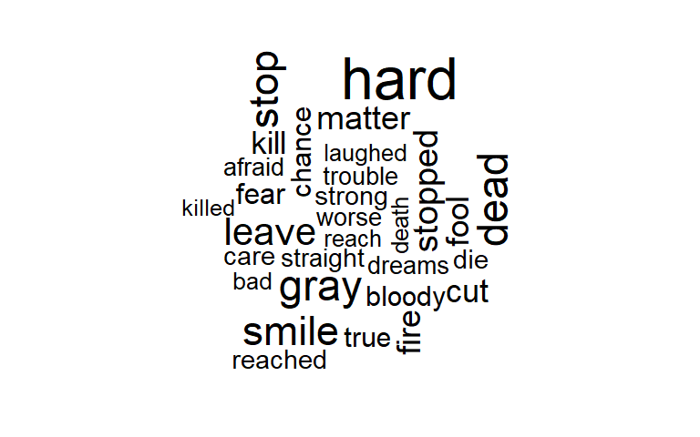
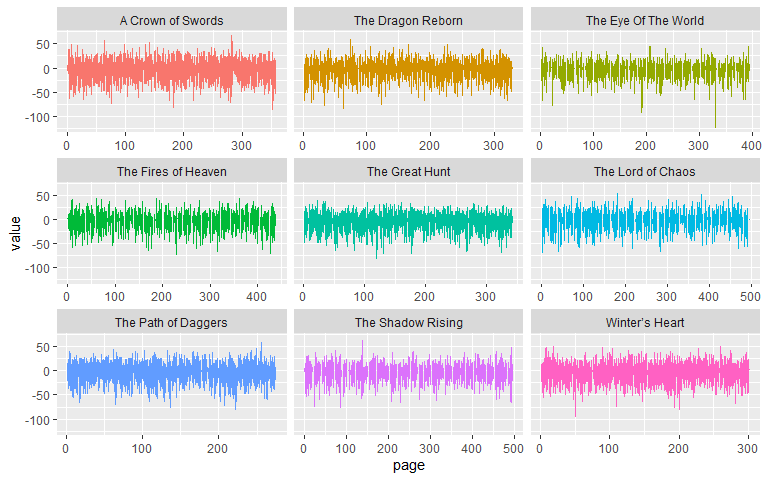
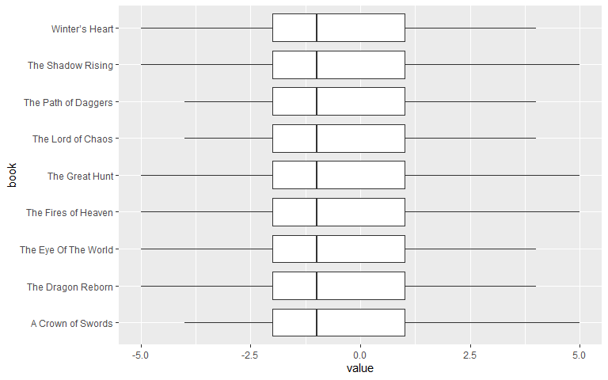
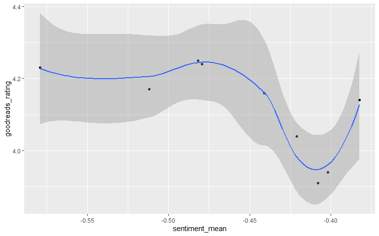

```r
library(tm)
library(pdftools)
library(here)
library(tidyverse)
library(tidytext)
library(wordcloud)
library(reshape2)
library(ggplot2)
```

# Abstract

As an avid reader, The Wheel of Time is one of my favorite high fantasy series. After learning about sentiment analysis in the DATA607 class, I was inspired to apply sentiment analysis to the first 9 books in the Wheel of Time series to compare the overall sentiment of each book to its related Goodreads rating and determine any correlation. I also hoped to see if the tone of the series changes with each book. My initial assumptions were that the series would get progressively more negative and that there would be some form of linear relationship between a series sentiment and its rating.

For my approach, I parsed the first 9 PDFs of the series and tokenized each word to match to a numerical positive or negative sentiment (from -5 to 5). Then, I plotted the sentiment progression by page for each book and gathered the initial set of summary statistics (mean, standard deviation etc.). Using linear regression, I found a near zero linear relationship between the page of a book and its corresponding sentiment value.

I compared the mean sentiment of each book to its respective Goodreads rating using linear regression. While the p-value (.04803) is less than .05, the adjusted R-squared is .3711 and thus there seems to be a very weak linear relationship between the mean sentiment of a book and its Goodreads rating with little statistical significance.

Further analysis can be done to strengthen my conclusion by including more books in the series as well as exploring other forms of sentiment analysis with more qualitative characteristics (anger, sadness, etc.). There were also some limitations while parsing the PDFs that could improve how the AFINN lexicon deals with fantasy terms that may have a different connotation within the novels.


# Data Preparation


## PDF Scraping

Here I build the path to all the pdfs stored in my project folder and call the `pdf_text` function to convert the PDFs into a character vector.


```r
path_to_pdfs <- here("WoT Sentiment Analysis","WoT")

book_files <- list.files(path = path_to_pdfs, pattern = "pdf$")

# add relative path to file list
complete_path <- function(x) { str_c(path_to_pdfs, "/",x)}
files <- complete_path(book_files)

# read in all pdfs in the WoT folder
wot <- suppressMessages(lapply(files, pdf_text))
```


I created a function `pdf_parse` to parse out the titles from the text, unnest words to a text column and remove stop words (and, the, etc.) using the default `stop_word` dataset.


```r
pdf_parse <- function(list) {
  data(stop_words)
  title <- list[1] %>% str_split("\n")
  title <- title[[1]][1]
  pdf_book <- tibble(book = title, page=1:length(list), text = list)
  pdf_book <- pdf_book %>% unnest_tokens(word, text)
  pdf_book <- pdf_book %>% anti_join(stop_words)
}

# parse all pdfs

all_books <- lapply(wot, pdf_parse)
```

```
## Joining, by = "word"
## Joining, by = "word"
## Joining, by = "word"
## Joining, by = "word"
## Joining, by = "word"
## Joining, by = "word"
## Joining, by = "word"
## Joining, by = "word"
## Joining, by = "word"
```

```r
glimpse(all_books)
```

```
## List of 9
##  $ : tibble [103,799 x 3] (S3: tbl_df/tbl/data.frame)
##   ..$ book: chr [1:103799] "A Crown of Swords" "A Crown of Swords" "A Crown of Swords" "A Crown of Swords" ...
##   ..$ page: int [1:103799] 1 1 1 1 2 2 2 2 2 2 ...
##   ..$ word: chr [1:103799] "crown" "swords" "robert" "jordan" ...
##  $ : tibble [84,142 x 3] (S3: tbl_df/tbl/data.frame)
##   ..$ book: chr [1:84142] "The Dragon Reborn" "The Dragon Reborn" "The Dragon Reborn" "The Dragon Reborn" ...
##   ..$ page: int [1:84142] 1 1 1 1 2 2 2 2 2 2 ...
##   ..$ word: chr [1:84142] "dragon" "reborn" "robert" "jordan" ...
##  $ : tibble [105,491 x 3] (S3: tbl_df/tbl/data.frame)
##   ..$ book: chr [1:105491] "The Eye Of The World" "The Eye Of The World" "The Eye Of The World" "The Eye Of The World" ...
##   ..$ page: int [1:105491] 1 1 1 1 2 2 2 2 2 2 ...
##   ..$ word: chr [1:105491] "eye" "world" "robert" "jordan" ...
##  $ : tibble [116,686 x 3] (S3: tbl_df/tbl/data.frame)
##   ..$ book: chr [1:116686] "The Fires of Heaven" "The Fires of Heaven" "The Fires of Heaven" "The Fires of Heaven" ...
##   ..$ page: int [1:116686] 1 1 1 1 2 2 2 2 2 2 ...
##   ..$ word: chr [1:116686] "fires" "heaven" "robert" "jordan" ...
##  $ : tibble [87,899 x 3] (S3: tbl_df/tbl/data.frame)
##   ..$ book: chr [1:87899] "The Great Hunt" "The Great Hunt" "The Great Hunt" "The Great Hunt" ...
##   ..$ page: int [1:87899] 1 1 1 2 2 2 2 2 2 2 ...
##   ..$ word: chr [1:87899] "hunt" "robert" "jordan" "prologue" ...
##  $ : tibble [136,298 x 3] (S3: tbl_df/tbl/data.frame)
##   ..$ book: chr [1:136298] "The Lord of Chaos" "The Lord of Chaos" "The Lord of Chaos" "The Lord of Chaos" ...
##   ..$ page: int [1:136298] 1 1 1 1 2 2 2 2 2 2 ...
##   ..$ word: chr [1:136298] "lord" "chaos" "robert" "jordan" ...
##  $ : tibble [82,263 x 3] (S3: tbl_df/tbl/data.frame)
##   ..$ book: chr [1:82263] "The Path of Daggers" "The Path of Daggers" "The Path of Daggers" "The Path of Daggers" ...
##   ..$ page: int [1:82263] 1 1 1 1 2 2 2 2 2 2 ...
##   ..$ word: chr [1:82263] "path" "daggers" "robert" "jordan" ...
##  $ : tibble [136,043 x 3] (S3: tbl_df/tbl/data.frame)
##   ..$ book: chr [1:136043] "The Shadow Rising" "The Shadow Rising" "The Shadow Rising" "The Shadow Rising" ...
##   ..$ page: int [1:136043] 1 1 1 1 2 2 2 2 2 2 ...
##   ..$ word: chr [1:136043] "shadow" "rising" "robert" "jordan" ...
##  $ : tibble [84,749 x 3] (S3: tbl_df/tbl/data.frame)
##   ..$ book: chr [1:84749] "Winter’s Heart" "Winter’s Heart" "Winter’s Heart" "Winter’s Heart" ...
##   ..$ page: int [1:84749] 1 1 1 1 2 2 2 2 2 2 ...
##   ..$ word: chr [1:84749] "winter’s" "heart" "robert" "jordan" ...
```

Now I have a list of all the books in a similar dataframe format that I can bind together


```r
# bind all dataframes together
all_books <- all_books %>% reduce(rbind)

all_books
```

```
## # A tibble: 937,370 x 3
##    book               page word  
##    <chr>             <int> <chr> 
##  1 A Crown of Swords     1 crown 
##  2 A Crown of Swords     1 swords
##  3 A Crown of Swords     1 robert
##  4 A Crown of Swords     1 jordan
##  5 A Crown of Swords     2 health
##  6 A Crown of Swords     2 grown 
##  7 A Crown of Swords     2 land  
##  8 A Crown of Swords     2 dragon
##  9 A Crown of Swords     2 reborn
## 10 A Crown of Swords     2 land  
## # ... with 937,360 more rows
```

## CSV Book Ratings

Here I read in the ratings from a csv to store for use after I perform sentiment analysis.


```r
csv_url <- here("WoT Sentiment Analysis", "book_ratings.csv")

ratings <- read.csv(csv_url)

ratings
```

```
##                   book goodreads_rating num_ratings book_num
## 1 The Eye Of The World             4.17      436923        1
## 2       The Great Hunt             4.23      254637        2
## 3    The Dragon Reborn             4.25      234968        3
## 4    The Shadow Rising             4.24      189853        4
## 5  The Fires of Heaven             4.16      153907        5
## 6    The Lord of Chaos             4.14      143274        6
## 7    A Crown of Swords             4.04      139194        7
## 8  The Path of Daggers             3.91      119925        8
## 9       Winter’s Heart             3.94      114984        9
```

With the dataframe of all the selected books and associated words I can apply sentiment analysis to gather positive or negative values using the AFINN lexicon

# Sentiment Analysis

## AFINN

I pull in the sentiment using the AFINN lexicon to get a quantitative value of a word's positive or negative sentiment.


```r
afinn <- get_sentiments("afinn") # -5 to 5

all_books_afinn <- all_books %>% inner_join(afinn)
```

```
## Joining, by = "word"
```

```r
all_books_afinn_pages <- all_books %>% inner_join(afinn) %>% group_by(book,page) %>% summarize(value = sum(value))
```

```
## Joining, by = "word"
```

```
## `summarise()` has grouped output by 'book'. You can override using the `.groups` argument.
```

```r
glimpse(all_books_afinn)
```

```
## Rows: 98,714
## Columns: 4
## $ book  <chr> "A Crown of Swords", "A Crown of Swords", "A Crown of Swords", "~
## $ page  <int> 2, 2, 2, 2, 2, 2, 2, 3, 3, 3, 3, 3, 3, 3, 4, 4, 4, 4, 4, 4, 4, 4~
## $ word  <chr> "fire", "proud", "pray", "tears", "fire", "love", "disputed", "t~
## $ value <dbl> -2, 2, 1, -2, -2, 3, -2, 2, 1, -1, -1, -2, -1, -2, 2, 1, -2, 2, ~
```

# Statistical Analysis

I want to analyze my dependent variable (goodreads_rating) and its relationship to the independent variable sentiment mean which is the mean of all the words sentiment value for each book and its relationship to the sentiment progression of a book - i.e. does a book become progressively more or less positive with a linear relationship to page number.

## Aggregated Statistics

I create a set of summary statistics for each book and its sentiment.


```r
#add positive and negative classifiers for chi square test
all_books_afinn <- all_books_afinn %>% mutate (positive = if_else(value > 0, 1, 0), negative = if_else(value < 0, 1, 0))

all_books_stats <- all_books_afinn %>% group_by(book) %>% summarize(num_words = n(), sentiment_stdev = sd(value), sentiment_mean = mean(value), sentiment_min = min(value), sentiment_max = max(value), positive = sum(positive), negative = sum(negative))
```

### Summary Statistics


```r
all_books_stats
```

```
## # A tibble: 9 x 8
##   book      num_words sentiment_stdev sentiment_mean sentiment_min sentiment_max
##   <chr>         <int>           <dbl>          <dbl>         <dbl>         <dbl>
## 1 A Crown ~     10928            1.91         -0.421            -4             5
## 2 The Drag~      8873            1.90         -0.482            -5             4
## 3 The Eye ~     10663            1.82         -0.512            -5             4
## 4 The Fire~     12632            1.89         -0.441            -5             5
## 5 The Grea~      8631            1.85         -0.579            -5             5
## 6 The Lord~     14687            1.92         -0.382            -4             4
## 7 The Path~      8634            1.89         -0.408            -4             4
## 8 The Shad~     14520            1.89         -0.479            -5             5
## 9 Winter’s~      9146            1.92         -0.402            -5             4
## # ... with 2 more variables: positive <dbl>, negative <dbl>
```


```r
word_count <- all_books_afinn %>% group_by(book) %>% count(word, sort= TRUE)
word_count_total <- all_books_afinn %>% group_by(word) %>% summarize(count = n()) %>% arrange(desc(count))
```

### Top 10 words across books


```r
word_count
```

```
## # A tibble: 9,268 x 3
## # Groups:   book [9]
##    book                 word      n
##    <chr>                <chr> <int>
##  1 The Lord of Chaos    hard    287
##  2 The Fires of Heaven  hard    250
##  3 The Shadow Rising    hard    229
##  4 The Lord of Chaos    dead    200
##  5 The Eye Of The World hard    193
##  6 Winter’s Heart       hard    191
##  7 The Lord of Chaos    smile   190
##  8 The Shadow Rising    stop    185
##  9 The Lord of Chaos    gray    181
## 10 The Eye Of The World fire    177
## # ... with 9,258 more rows
```

### Top 30 words


```r
wordcloud(word_count_total$word, word_count_total$count, max.words = 30)
```

<!-- -->


## Page Linear Regression Model

Here we can see that the books sentiment stay about the same for each book in the series as well as for each page in a book.

```r
ggplot(all_books_afinn_pages, aes(x=page,y=value)) + geom_point() + geom_smooth() + facet_wrap(~book, scales = "free_x")
```

```
## `geom_smooth()` using method = 'loess' and formula 'y ~ x'
```

<!-- -->

```r
ggplot(all_books_afinn, aes(page, value, fill = book)) +
  geom_col(show.legend = FALSE) +
  facet_wrap(~book, ncol = 3, scales = "free_x")
```

<!-- -->

```r
ggplot(all_books_afinn, aes(x=book,y=value)) + geom_boxplot() + coord_flip()
```

<!-- -->

```r
page_model<-lm(value~page,data=all_books_afinn_pages)

summary(page_model)
```

```
## 
## Call:
## lm(formula = value ~ page, data = all_books_afinn_pages)
## 
## Residuals:
##     Min      1Q  Median      3Q     Max 
## -91.968  -8.973   1.076  11.047  52.085 
## 
## Coefficients:
##               Estimate Std. Error t value Pr(>|t|)    
## (Intercept) -1.310e+01  5.285e-01 -24.787   <2e-16 ***
## page         2.074e-04  2.259e-03   0.092    0.927    
## ---
## Signif. codes:  0 '***' 0.001 '**' 0.01 '*' 0.05 '.' 0.1 ' ' 1
## 
## Residual standard error: 16.2 on 3419 degrees of freedom
## Multiple R-squared:  2.465e-06,	Adjusted R-squared:  -0.00029 
## F-statistic: 0.008429 on 1 and 3419 DF,  p-value: 0.9269
```
Our model shows that there is no linear relationship between what page you're on in a book and the associated sentiment value of that page.

## Sentiment Mean Linear Regression Model

I combine the ratings with the summary statistics dataframe to provide the necessary information for the sentiment mean linear regression model.


```r
combined_books <- inner_join(all_books_stats, ratings, by = "book")
combined_books
```

```
## # A tibble: 9 x 11
##   book      num_words sentiment_stdev sentiment_mean sentiment_min sentiment_max
##   <chr>         <int>           <dbl>          <dbl>         <dbl>         <dbl>
## 1 A Crown ~     10928            1.91         -0.421            -4             5
## 2 The Drag~      8873            1.90         -0.482            -5             4
## 3 The Eye ~     10663            1.82         -0.512            -5             4
## 4 The Fire~     12632            1.89         -0.441            -5             5
## 5 The Grea~      8631            1.85         -0.579            -5             5
## 6 The Lord~     14687            1.92         -0.382            -4             4
## 7 The Path~      8634            1.89         -0.408            -4             4
## 8 The Shad~     14520            1.89         -0.479            -5             5
## 9 Winter’s~      9146            1.92         -0.402            -5             4
## # ... with 5 more variables: positive <dbl>, negative <dbl>,
## #   goodreads_rating <dbl>, num_ratings <int>, book_num <int>
```

The key assumptions for a simple linear regression model are:

1.	Linearity: The relationship between X and the mean of Y is linear
2.	Homoscedasticity: The variance of the residual is the same for any value of X
3.	Independence: Observations are independent of each other
4.	Normality: For any fixed value of X, Y is normally distributed

The dataset roughly meets all of those criteria although it seems like there might be an outlier book with a high rating and a higher sentiment_mean.


```r
combined_books %>% ggplot(aes(x=sentiment_mean, y = goodreads_rating)) + geom_point() + geom_smooth()
```

```
## `geom_smooth()` using method = 'loess' and formula 'y ~ x'
```

<!-- -->


```r
model<-lm(goodreads_rating~sentiment_mean,data=combined_books)

summary(model)
```

```
## 
## Call:
## lm(formula = goodreads_rating ~ sentiment_mean, data = combined_books)
## 
## Residuals:
##      Min       1Q   Median       3Q      Max 
## -0.14389 -0.05745 -0.02602  0.08840  0.12071 
## 
## Coefficients:
##                Estimate Std. Error t value Pr(>|t|)    
## (Intercept)      3.4974     0.2625  13.325 3.14e-06 ***
## sentiment_mean  -1.3646     0.5705  -2.392    0.048 *  
## ---
## Signif. codes:  0 '***' 0.001 '**' 0.01 '*' 0.05 '.' 0.1 ' ' 1
## 
## Residual standard error: 0.1014 on 7 degrees of freedom
## Multiple R-squared:  0.4498,	Adjusted R-squared:  0.3711 
## F-statistic: 5.722 on 1 and 7 DF,  p-value: 0.04803
```

With a low adjusted R-squared at .3711, the low p-value (.04803) is not significant. The model is also pretty limited based on the small sample size of books. Further analysis would include up to 15 books and provide some more confidence in the model, as well as potential expansion to other high fantasy series to see if the trend holds. 

Other limitations are that I used word sentiment instead of sentence sentiment. It's possible that the overall sentiment of a book could change if I used a sentence token over a word token. For example, the word `gray` is ranked at -1 in the AFINN lexicon, but it could be in a neutral context when describing a characters eyes. There could also be a difference if I used a chapter separation instead of page separation when analyzing a book's sentiment over the course of the book. These could all be future extensions of the analysis.

# Citations

Finn Årup Nielsen A new ANEW: Evaluation of a word list for sentiment analysis in microblogs. Proceedings of the ESWC2011 Workshop on 'Making Sense of Microposts': Big things come in small packages 718 in CEUR Workshop Proceedings 93-98. 2011 May. http://arxiv.org/abs/1103.2903.
