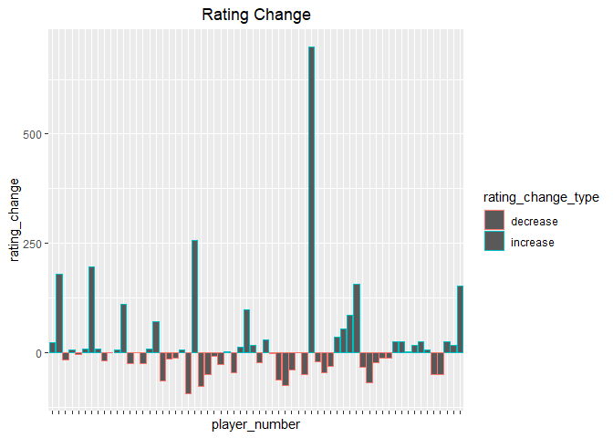
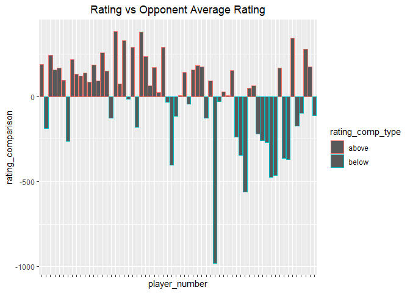

## Read in .txt file 


```r
chess_elo <- read.csv("https://raw.githubusercontent.com/sserrot/DATA607/main/Project%201/tournamentinfo.txt")
#display first two player rows
head(chess_elo, n=9)
```

```
##   X.........................................................................................
## 1  Pair | Player Name                     |Total|Round|Round|Round|Round|Round|Round|Round| 
## 2  Num  | USCF ID / Rtg (Pre->Post)       | Pts |  1  |  2  |  3  |  4  |  5  |  6  |  7  | 
## 3  -----------------------------------------------------------------------------------------
## 4      1 | GARY HUA                        |6.0  |W  39|W  21|W  18|W  14|W   7|D  12|D   4|
## 5     ON | 15445895 / R: 1794   ->1817     |N:2  |W    |B    |W    |B    |W    |B    |W    |
## 6  -----------------------------------------------------------------------------------------
## 7      2 | DAKSHESH DARURI                 |6.0  |W  63|W  58|L   4|W  17|W  16|W  20|W   7|
## 8     MI | 14598900 / R: 1553   ->1663     |N:2  |B    |W    |B    |W    |B    |W    |B    |
## 9  -----------------------------------------------------------------------------------------
```

## Split out rows

Here, we'll split out each row delimited by dashes and then commas to get a list of all the players data


```r
chess_elo <- chess_elo %>% str_split("-----------------------------------------------------------------------------------------")
chess_elo <- chess_elo[[1]]
chess_elo <- chess_elo %>% str_split(",")
chess_elo_players <- chess_elo[2:length(chess_elo)]
head(chess_elo_players, n=2)
```

```
## [[1]]
## [1] "\""                                                                                            
## [2] " \"    1 | GARY HUA                        |6.0  |W  39|W  21|W  18|W  14|W   7|D  12|D   4|\""
## [3] " \"   ON | 15445895 / R: 1794   ->1817     |N:2  |W    |B    |W    |B    |W    |B    |W    |\""
## [4] " \""                                                                                           
## 
## [[2]]
## [1] "\""                                                                                              
## [2] " \n\"    2 | DAKSHESH DARURI                 |6.0  |W  63|W  58|L   4|W  17|W  16|W  20|W   7|\""
## [3] " \"   MI | 14598900 / R: 1553   ->1663     |N:2  |B    |W    |B    |W    |B    |W    |B    |\""  
## [4] " \""
```


## Loops for creating vectors

We need to loop through each player in the data and extract each of the key values we want to store:

* Player Number
* Player Name
* Player Points
* Player pre tournament chess rating
* Player average opponent rating


Here is an example:

",  "    1 | GARY HUA                        |6.0  |W  39|W  21|W  18|W  14|W   7|D  12|D   4|",  "   ON | 15445895 / R: 1794   ->1817     |N:2  |W    |B    |W    |B    |W    |B    |W    |",  "


```r
# empty list for instantiation

player_number <- c()
player_name <- c()
player_points <- c()

player_state <- c()
pre_tournament_rating <- c()
post_tournament_rating <- c()

#iterate through players and parse out each game and append each value to a list
for(player in chess_elo_players) { 
  first_line <- player[2] %>% str_split("\\|") %>% unlist()
  
  #check if any of the games are NA
  
  if(any(!is.na(first_line)) == TRUE){
    player_number <- c(player_number, first_line[1] %>% str_extract("[0-9]+"))
    player_name <- c(player_name, first_line[2] %>% trimws())
    player_points <- c(player_points, first_line[3] %>% trimws() %>% as.numeric())
    }
  
  second_line <- player[3] %>% str_split("\\|") %>% unlist()
  
  player_rating <- second_line[1:2]
  player_state <- c(player_state, player_rating[1] %>% str_extract("[a-zA-Z]+"))
  player_chess_rating <- player_rating[2] %>% str_split("/") %>% unlist() %>% str_split ("->") %>% unlist() %>% trimws() %>% str_extract("[0-9]+")
  pre_tournament_rating <- c(pre_tournament_rating, player_chess_rating[2])
  post_tournament_rating <- c(post_tournament_rating, player_chess_rating[3])
    
    
}
#remove NAs
pre_tournament_rating <- pre_tournament_rating[!is.na(pre_tournament_rating)] %>% as.numeric()
post_tournament_rating <- post_tournament_rating[!is.na(post_tournament_rating)] %>% as.numeric()
player_state <- player_state[!is.na(player_state)]


tournament_df <- tibble(player_number, player_name, player_state, player_points, pre_tournament_rating, post_tournament_rating)
```

Now we have a dataframe of all the original data:


```r
head(tournament_df, n=9)
```

```
## # A tibble: 9 x 6
##   player_number player_name         player_state player_points pre_tournament_r~
##   <chr>         <chr>               <chr>                <dbl>             <dbl>
## 1 1             GARY HUA            ON                     6                1794
## 2 2             DAKSHESH DARURI     MI                     6                1553
## 3 3             ADITYA BAJAJ        MI                     6                1384
## 4 4             PATRICK H SCHILLING MI                     5.5              1716
## 5 5             HANSHI ZUO          MI                     5.5              1655
## 6 6             HANSEN SONG         OH                     5                1686
## 7 7             GARY DEE SWATHELL   MI                     5                1649
## 8 8             EZEKIEL HOUGHTON    MI                     5                1641
## 9 9             STEFANO LEE         ON                     5                1411
## # ... with 1 more variable: post_tournament_rating <dbl>
```
## Tournament Analysis

However, we want to calculate an average of all the player's opponents chess ratings. 
There are many different ways to approach this issue. I chose to simply 

  1. Go through all the games played which is represented by a player number  
  2. Replace the player number with the player ranking  
  3. Calculate the average rating for those games  

We have to be sure to ignore NAs for those players that played less than 7 rounds.

We can also take the player opponent chess ratings and calculate the expected outcome
Using the formula from the [Wikipedia Elo page](https://en.wikipedia.org/wiki/Elo_rating_system#Mathematical_details), we can calculate the expected value as below:

`Player 1 Expected Rating = 1 / 1 + 10 ^ [(OppRating - Rating) / 400]


```r
elo_calc <- function(opponent_elo, player_elo) {
  expected_outcome <- 1 / (1+ 10^((opponent_elo - player_elo)/400))
  return(expected_outcome)
}

#test function
elo_calc(1400, 1000) # expected outcome of a player with rating 1000 against rating 1400 (win = 1, draw = .5, loss = 0)
```

```
## [1] 0.09090909
```


```r
## redo players for just games to get average since we got all the prechess ratings linked to players now
average_opponent_rating <- c()
expected_points <- c()
for (player in chess_elo_players) {
  rating_list <- c()
  
  games_played <- player[2] %>% str_split("\\|") %>% unlist()
  player_number <- games_played[1] %>% str_extract("[0-9]+") %>% as.numeric() # for elo calculation
  
  games_played <- games_played[4:10]
  slice <- games_played %>% str_extract("[0-9]+") %>% as.numeric()
  rating_list <- tournament_df$pre_tournament_rating[slice]
  rating_list <- rating_list[!is.na(rating_list)] %>% as.numeric() # list of opponent ratings
  average_opponent_rating <- c(average_opponent_rating, mean(rating_list))
  
  # for elo calculation - expected outcomes
  expected_points <- c(expected_points, sapply(rating_list, elo_calc, player_elo=tournament_df$pre_tournament_rating[player_number]) %>% unlist() %>% sum() %>% format(digits = 2) %>% as.numeric())
}

# round elo and remove na at the end

average_opponent_rating <- average_opponent_rating[!is.na(average_opponent_rating)] %>% round()
expected_points <- expected_points[!expected_points==0]

tournament_df <- tournament_df %>% add_column(average_opponent_rating)

tournament_df <- tournament_df %>% add_column(expected_points)

glimpse(tournament_df)
```

```
## Rows: 64
## Columns: 8
## $ player_number           <chr> "1", "2", "3", "4", "5", "6", "7", "8", "9", "~
## $ player_name             <chr> "GARY HUA", "DAKSHESH DARURI", "ADITYA BAJAJ",~
## $ player_state            <chr> "ON", "MI", "MI", "MI", "MI", "OH", "MI", "MI"~
## $ player_points           <dbl> 6.0, 6.0, 6.0, 5.5, 5.5, 5.0, 5.0, 5.0, 5.0, 5~
## $ pre_tournament_rating   <dbl> 1794, 1553, 1384, 1716, 1655, 1686, 1649, 1641~
## $ post_tournament_rating  <dbl> 1817, 1663, 1640, 1744, 1690, 1687, 1673, 1657~
## $ average_opponent_rating <dbl> 1605, 1469, 1564, 1574, 1501, 1519, 1372, 1468~
## $ expected_points         <dbl> 5.2, 3.8, 1.9, 4.7, 4.4, 4.9, 4.6, 5.0, 2.3, 1~
```


```r
tournament_df <- tournament_df %>% mutate(expected_points_difference = as.numeric(format(player_points - expected_points, digits = 2)))

tournament_df <- tournament_df %>% mutate(rating_change = post_tournament_rating - pre_tournament_rating)

tournament_df <- tournament_df %>%
  mutate(rating_change_type = ifelse(rating_change > 0, "increase", "decrease"))

tournament_df <- tournament_df %>% mutate(rating_comparison = pre_tournament_rating - average_opponent_rating)

tournament_df <- tournament_df %>%
  mutate(rating_comp_type = ifelse(rating_comparison > 0, "above", "below"))
```

## Rating Change and Rating Comparison


```r
tournament_df %>% ggplot(aes(x = player_number, y = rating_change, color = rating_change_type)) + geom_col() +ggtitle("Rating Change") +theme(plot.title = element_text(hjust = 0.5), axis.text.x=element_blank())
```

<!-- -->

```r
tournament_df %>% ggplot(aes(x = player_number, y = rating_comparison, color = rating_comp_type)) + geom_col() +ggtitle("Rating vs Opponent Average Rating") +theme(plot.title = element_text(hjust = 0.5), axis.text.x=element_blank())
```

<!-- -->


## Extra Credit

Expected points difference


```r
tournament_df[which.max(tournament_df$expected_points_difference),] %>% select(player_name, player_points, expected_points, rating_change, expected_points_difference)
```

```
## # A tibble: 1 x 5
##   player_name  player_points expected_points rating_change expected_points_diff~
##   <chr>                <dbl>           <dbl>         <dbl>                 <dbl>
## 1 ADITYA BAJAJ             6             1.9           256                   4.1
```
However based off of actual rating change it would be:

```r
tournament_df[which.max(tournament_df$rating_change),] %>% select(player_name, player_points, expected_points, rating_change, expected_points_difference)
```

```
## # A tibble: 1 x 5
##   player_name     player_points expected_points rating_change expected_points_d~
##   <chr>                   <dbl>           <dbl>         <dbl>              <dbl>
## 1 JACOB ALEXANDE~             3           0.043           699               2.96
```


## CSV Output


Output results to csv  


```r
tournament_df %>% write.csv("Tournament Players.csv", row.names = FALSE)
```
